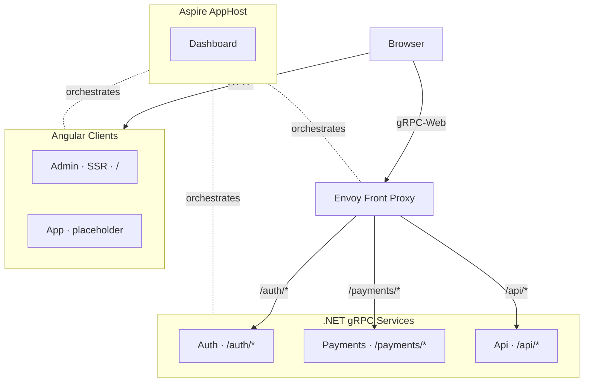

# ProtoFast

## Infrastructure



All ports are dynamically assigned by Aspire at startup — nothing is hardcoded.
The browser loads the Angular clients directly. gRPC-Web requests from
the clients flow through Envoy, which routes to the backend services
by path prefix.

## Requirements

- Tooling:
  - Python 3
  - Node.js LTS (includes `npm` / `npx`)
  - Angular CLI
  - `uv` / `uvx`
  - Docker Engine
  - Aspire CLI (user-local under `~/.aspire/bin`)
- Skills
  - Angular agent skills `npx skills add https://github.com/angular/skills`

## Install

An idempotent setup script is provided to install any missing tooling. It is currently only tested on Ubuntu 24; on other distros/OSes you'll need to install the tools above manually.

```bash
bash scripts/setup-dev-dependencies.sh
```

## Running the app

The whole stack (Aspire AppHost + .NET gRPC services + Angular admin client +
Envoy proxy) is started via the Aspire CLI from the repo root:

```bash
aspire run
```

This launches:

- Envoy front proxy (proxies all traffic; ports assigned by Aspire)
- Angular `admin` client with SSR (proxied via Envoy at `/`)
- .NET gRPC services from `services/` (proxied via Envoy):
  - `auth`     at `/auth/*`
  - `payments` at `/payments/*`
  - `api`      at `/api/*`
- The Aspire dashboard (URL printed in the terminal on startup)

All resource URLs (including Envoy) are shown in the Aspire dashboard.

`clients/app/` is reserved for an end-user Angular client and is not yet
scaffolded.

Stop everything with `Ctrl+C`, or from another shell:

```bash
aspire stop
```
