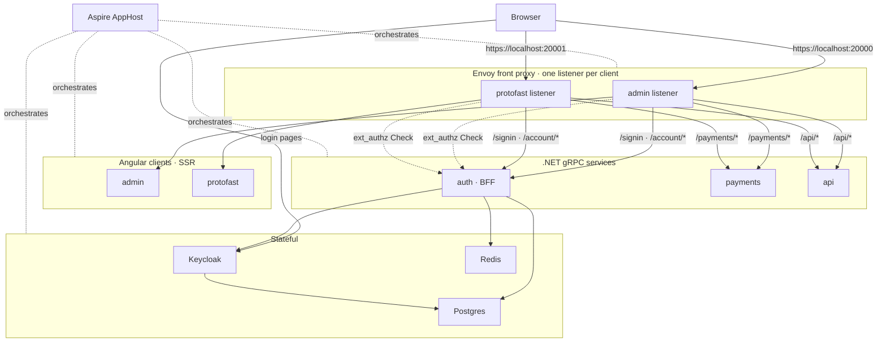

# ProtoFast

## Infrastructure


```mermaid
graph TD
    Browser["Browser"]

    subgraph Envoy["Envoy front proxy · one listener per client"]
        LAdmin["admin listener"]
        LPF["protofast listener"]
    end

    subgraph Clients["Angular clients · SSR"]
        NgAdmin["admin"]
        NgPF["protofast"]
    end

    subgraph Services[".NET gRPC services"]
        Auth["auth · BFF"]
        Payments["payments"]
        Api["api"]
    end

    subgraph State["Stateful"]
        KC["Keycloak"]
        PG["Postgres"]
        Redis["Redis"]
    end

    Browser -->|"https://localhost:20000"| LAdmin
    Browser -->|"https://localhost:20001"| LPF
    Browser -->|"login pages"| KC

    LAdmin --> NgAdmin
    LPF --> NgPF
    LAdmin & LPF -->|"/signin · /account/*"| Auth
    LAdmin & LPF -->|"/payments/*"| Payments
    LAdmin & LPF -->|"/api/*"| Api
    LAdmin & LPF -.->|"ext_authz Check"| Auth

    Auth --> KC
    Auth --> Redis
    Auth --> PG
    KC --> PG

    Aspire["Aspire AppHost"] -.-|orchestrates| Envoy
    Aspire -.-|orchestrates| Clients
    Aspire -.-|orchestrates| Services
    Aspire -.-|orchestrates| State
```

Every request goes through Envoy: each client gets its own HTTPS listener, so pages and API calls share one origin. Envoy routes by path prefix — `/payments/*` and `/api/*` to the gRPC services, sign-in and account endpoints to `auth` — and asks `auth` who the caller is (ext_authz) before forwarding anything else. Ports are assigned by Aspire at startup, except the two client listeners, which are pinned because Keycloak's redirect URIs are exact.

For the full picture, including the production topology, see [docs/new/01-topology.md](docs/new/01-topology.md).

## Requirements

- Tooling:
  - Node.js 24+ `(npm` / `npx`)
  - Angular CLI
  - Docker Engine
  - Aspire CLI
- Skills
  - Angular agent skills `npx skills add https://github.com/angular/skills`


## Install

An idempotent setup script is provided to install any missing tooling. It is currently only tested on Ubuntu 24; on other distros/OSes you'll need to install the tools above manually.

```bash
bash scripts/setup-dev-dependencies.sh
```


## Running the app

The whole stack (Aspire AppHost + .NET gRPC services + Angular admin client +
Envoy proxy) is started via the Aspire CLI from the repo root:

```bash
aspire run
```

This launches:

- Envoy front proxy (proxies all traffic; ports assigned by Aspire)
- Angular `admin` client with SSR (proxied via Envoy at `/`)
- .NET gRPC services from `services/` (proxied via Envoy):
  - `auth`     at `/auth/*`
  - `payments` at `/payments/*`
  - `api`      at `/api/*`
- The Aspire dashboard (URL printed in the terminal on startup)

Stop everything with `Ctrl+C`, or from another shell:

```bash
aspire stop
```

