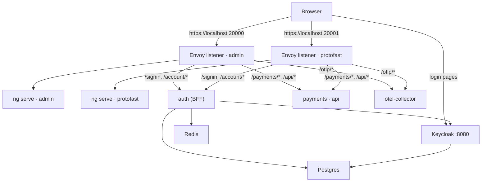
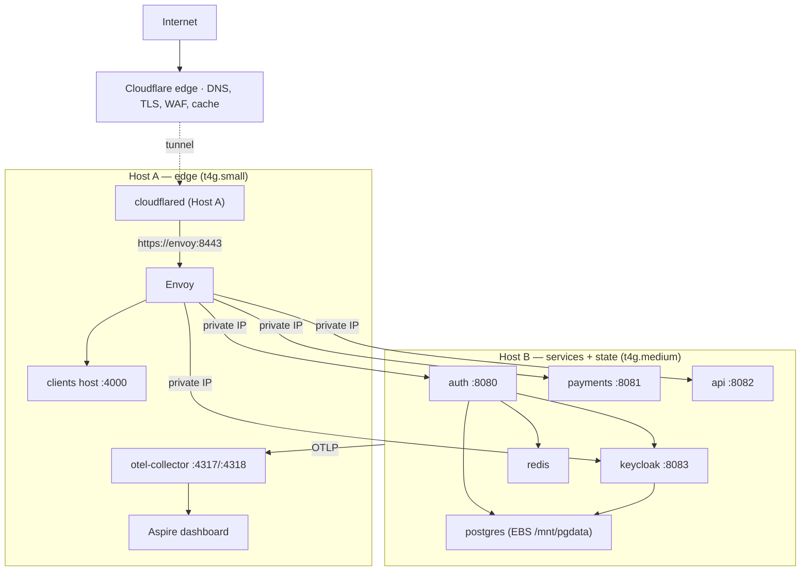

# 01 · Topology

*What runs, where it runs, and the path a request takes.*

## The pieces

| Piece              | What it is                                               | Source                              |
| ------------------ | -------------------------------------------------------- | ----------------------------------- |
| `protofast` client | Angular SSR app — the product site                       | `clients/protofast`                 |
| `admin` client     | Angular SSR app — the admin console                      | `clients/admin`                     |
| clients host       | One Node process that serves *every* client's SSR bundle | `clients/host`                      |
| `envoy`            | The edge proxy: TLS, routing, CORS, identity annotation  | `proxy/`                            |
| `auth`             | BFF: sign-in, sessions, account management, ext_authz    | `services/auth`                     |
| `payments`, `api`  | gRPC services behind the internal JWT                    | `services/payments`, `services/api` |
| Keycloak           | Identity provider (realm `protofast`)                    | `infra/keycloak`, `deploy/keycloak` |
| Postgres           | Keycloak's `keycloak` DB + auth's `auth` DB              | upstream image                      |
| Redis              | Session / correlation / replay cache (in-memory only)    | upstream image                      |
| otel-collector     | OTLP ingest → Aspire dashboard                           | `otel-collector/`                   |

## Development

`aspire run` starts everything as local processes and containers. Ports are
assigned by Aspire at startup **except** the two Envoy client listeners, which are
pinned because Keycloak's redirect URIs are exact.

Key facts:

- One **listener per client** (`20000` = admin, `20001` = protofast). Pages and
API share an origin, so there is no cross-origin problem to solve.
- Keycloak is reached **directly** on `:8080` in dev — it is not behind Envoy.
- Both listeners are `localhost`, so the browser keeps one cookie jar: signing in
on one port signs you in on the other. That is a dev-only artefact.

## Production

Two EC2 instances in one subnet, no inbound ports on either.

Key facts:

- **Public hostnames**: `protofast.dev` and `admin.protofast.dev` (the clients),
`auth.protofast.dev` (Keycloak's login pages), optionally a telemetry hostname
for the Aspire dashboard behind Cloudflare Access. All are proxied CNAMEs to
the tunnel; all land on Envoy's single `:8443` listener except telemetry.
- **Cross-host traffic** uses static private IPs (`HOST_A_IP`, `HOST_B_IP`,
derived from the subnet CIDR) over ports `8080–8083` (Host B) and `4317/4318`
(Host A's OTLP receivers). A self-referencing security group admits only the
sibling instance.
- **Only Host B holds state.** Postgres lives on a separate EBS volume that
survives instance replacement; Redis is deliberately memory-only.
- Host A is disposable: on boot it pulls the published manifest from S3 and
brings itself back up.

## The path of a request

**A page load** (`GET https://protofast.dev/app`)
Cloudflare → tunnel → Envoy `:8443` → vhost `protofast` matched by Host header →
ext_authz asks `auth` who the caller is (session cookie → `x-user-id` headers) →
clients host, tagged `x-client: protofast` → that client's SSR bundle renders.
If the path is protected and no `x-user-id` arrived, SSR redirects to `/signin`.

**A gRPC-Web call** (`POST /api/…`)
Same edge, but the route strips the `/api/` prefix and forwards to the `api`
cluster with no timeout. The backend enforces the **internal JWT** minted by
`auth`; the edge only annotates.

**A sign-in**
`/signin` (allow-listed on the vhost, ext_authz off) → `auth` starts an OIDC
authorization code + PKCE flow → the browser goes to `auth.protofast.dev`
(Keycloak, through its own Envoy vhost) → Keycloak redirects back to
`/signin-oidc` → `auth` exchanges the code back-channel over the private network,
stores the session in Redis and sets the `pf_session` cookie.

## Dev vs prod, at a glance

|              | Development                                     | Production                                            |
| ------------ | ----------------------------------------------- | ----------------------------------------------------- |
| Orchestrator | Aspire AppHost (`apphost/Program.cs`)           | `docker compose` per host                             |
| Envoy mode   | `dev` (one listener per client)                 | `publish` (one listener, vhost per domain)            |
| Clients      | `ng serve` per client, HMR                      | prebuilt bundles pulled from S3 into the clients host |
| Keycloak     | direct on `:8080`                               | behind Envoy's allow-listed `keycloak` vhost          |
| Secrets      | `appsettings.Development.json` + generated keys | AWS Secrets Manager `protofast/app`                   |
| TLS          | Aspire dev certificate                          | Cloudflare edge cert + baked internal cert            |
| Telemetry    | Aspire dashboard (local)                        | otel-collector on Host A → Aspire dashboard           |

