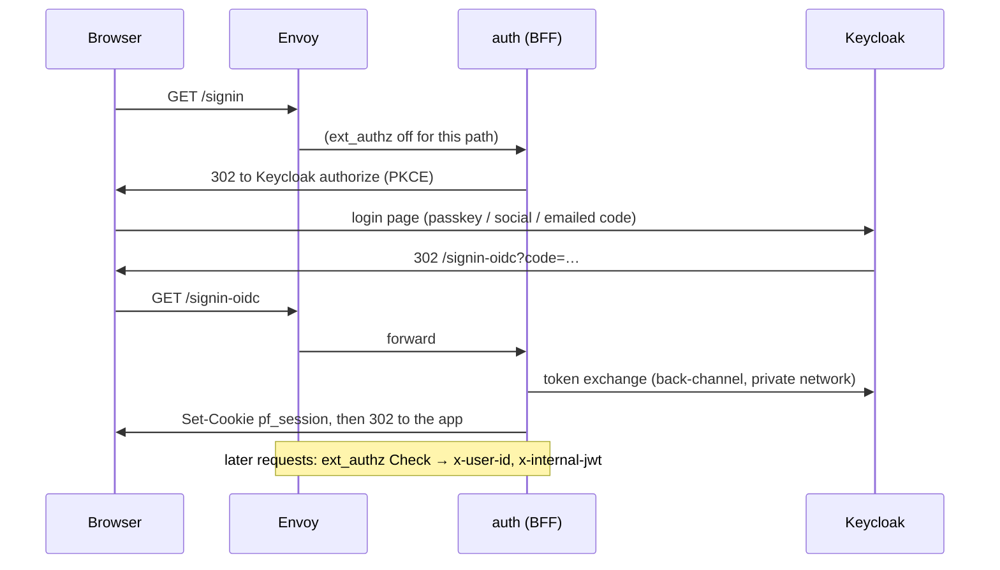

# 05 · Identity

*How sign-in is configured: the Keycloak realm, the auth service that fronts it,
and how the two are kept in step. Self-contained.*

## The shape

`auth` is a **backend-for-frontend**. Browsers never hold a token: they hold an
opaque `pf_session` cookie, and `auth` keeps the real OIDC tokens in Redis.

On every subsequent request Envoy calls `auth`'s gRPC `Check`, which resolves the
cookie and injects `x-user-id`, `x-tenant`, `x-roles` and `x-internal-jwt` — and
**strips those headers from anonymous requests** so a client cannot smuggle them.
Backends trust only the internal JWT; SSR uses `x-user-id` for personalisation and
for its protected-path gate.

## The credential model

There are **no passwords in any realm**. An account is reached by passkey, by
Google or Apple, or by a code typed from an email. That single decision explains
most of the realm file: empty `passwordPolicy`, `resetPasswordAllowed: false`,
`UPDATE_PASSWORD` disabled, and a brute-force `failureFactor` of 10 tuned for
guessing a six-digit code.

The mailbox therefore opens every account, including one that has a passkey — it
has to, or a passkey holder on a new laptop is locked out.

Passkeys are **offered, never required**: after a successful sign-in `auth` sends
an ordinary authorize request carrying
`kc_action=webauthn-register-passwordless`, and cancelling costs nothing.

## Configuring `auth`

All keys arrive as `Auth_*` environment variables (see [layer 03](03-services-and-clients.md)
for the naming rules).

| Key | Dev | Production |
|---|---|---|
| `Keycloak:Authority` | the AppHost-assigned Keycloak URL | `http://keycloak:8080` (private, same host) |
| `Keycloak:PublicAuthority` | empty → falls back to `Authority` | `https://${KEYCLOAK_DOMAIN}` — used for redirects and as the expected token issuer |
| `Keycloak:ClientSecretProtofastWeb` / `…Admin` / `…TheplotWeb` | from Secrets Manager (`dev-*-secret` defaults) | from Secrets Manager |
| `Keycloak:AdminClientId` / `AdminClientSecret` | `account-admin` / from Secrets Manager | from Secrets Manager; empty disables account management (503) instead of failing startup |
| `Keycloak:AdminClientSecretByRealm:<realm>` | `theplot` → dev secret | per-realm override of `AdminClientSecret`. A client secret only authenticates in the realm that issued it, so every realm with an `account-admin` client needs its own |
| `Tenants:ByHost:<key>:Realm` / `:ClientId` / `:Host` | `localhost` → `protofast` / `protofast-web`; `theplot-dev` (`Host: localhost:20002`) → `theplot` / `theplot-web` | `protofast.dev` → `protofast-web`, `admin.protofast.dev` → `admin`, `theplot.protofast.dev` → `theplot-web` |
| `Tenants:ByHost:admin…:MaxAge` / `:AcrValues` | — | forces re-authentication (and optionally a passkey) when entering the admin console |
| `Session:*` | defaults | defaults: `pf_session`, 8 h idle, 7 d absolute, id rotated on refresh |
| `InternalJwt:PrivateKeyPem` / `:KeyId` | from Secrets Manager (`protofast/dev`) | private PEM from Secrets Manager; never a file in prod |
| `Smtp:*` | smtp4dev, injected by the AppHost | SES relay, same credentials Keycloak uses |
| `Subscriptions:Enabled` | off | off until billing exists |

A host that is not in `Tenants:ByHost` is never guessed — it routes public.

Matching is on **host and port**, most specific first: an entry naming a port
wins, and a portless entry still serves every port on that name. That is what
separates the three dev clients, which all answer on `localhost` and differ only
by port (20000 admin, 20001 protofast, 20002 theplot). Production hosts carry no
port and need no port-qualified entry.

**A port cannot go in the key.** Configuration keys are colon-delimited in every
provider — JSON flattens to the same key space that `__` maps into — so
`"localhost:20002"` binds as the nested section `localhost` → `20002` and the
entry vanishes at bind time with no error, leaving the host to fall back to the
bare `localhost` entry. Give such an entry a plain label for its key and put the
real host in `Host`, which is what `theplot-dev` does. Entries whose host has no
port keep using the key directly, so nothing else changes.

**Why two Keycloak authorities?** Tokens are stamped with the issuer captured
during the browser login. If the back-channel used a different URL, the refresh
grant would fail with "Invalid token issuer" and every session would die at its
first refresh. Prod pins `KC_HOSTNAME` to the full public URL and keeps
`KC_HOSTNAME_BACKCHANNEL_DYNAMIC=false` for exactly this reason.

## Configuring Keycloak

Keycloak is configured by four things:

1. **The realm import** — `infra/keycloak/realms/protofast-realm.json` (dev, via
   Aspire `WithRealmImport`) and its synchronised copy at
   `deploy/keycloak/realms/` (prod, bind-mounted for `--import-realm`). Secrets and
   URLs inside it are `${VAR:default}` placeholders substituted from the
   environment; placeholder substitution only happens because both environments set
   `JAVA_OPTS_APPEND=-Dkeycloak.migration.replace-placeholders=true`.

   | Placeholder | Supplies |
   |---|---|
   | `PROTOFAST_WEB_CLIENT_SECRET`, `ADMIN_CLIENT_SECRET`, `ACCOUNT_ADMIN_CLIENT_SECRET` | the three confidential client secrets |
   | `PROTOFAST_WEB_BASE_URL`, `ADMIN_BASE_URL` | each client's "Home URL" |
   | `BACKCHANNEL_LOGOUT_URL` | where Keycloak posts logout tokens |
   | `SMTP_HOST/PORT/FROM/USER/PASSWORD/AUTH/STARTTLS/SSL` | the realm's mail server |
   | `GOOGLE_*`, `APPLE_*` | social sign-in (both providers ship **disabled**) |
   | `WEBAUTHN_RP_ID` | `localhost` in dev, `protofast.dev` in prod |

2. **The themes** — `deploy/keycloak/themes/protofast` and
   `deploy/keycloak/themes/theplot` (login + email each), bind-mounted in both
   environments; each realm's `loginTheme`/`emailTheme` names its own. They are
   standalone siblings — separate brands, free to diverge — except for the `pf-*`
   class names, which the shared provider JAR's templates hardcode.
3. **The provider JAR** — `deploy/keycloak/providers/protofast-keycloak.jar`, built
   from `infra/keycloak/providers/email-otp`. It supplies the `email-otp`
   authenticator, the `verify-email-code` required action, the claiming user-creation
   form action and the Apple identity provider. **The browser flow names `email-otp`
   by id, so Keycloak cannot run the flow without this JAR.**
4. **`KC_*` environment variables** — DB coordinates, `KC_HOSTNAME`,
   `KC_PROXY_HEADERS=xforwarded`, `KC_HEALTH_ENABLED`, theme static max-age, and the
   tracing/logging exporters that point at the OTel collector.

### Two realms

There are **two** realms, both imported from the same directory (`--import-realm`
reads all of it):

| Realm | Hosts | Clients |
|---|---|---|
| `protofast` | `protofast.dev`, `admin.protofast.dev` | `protofast-web`, `admin`, `account-admin` |
| `theplot` | `theplot.protofast.dev` | `theplot-web`, `account-admin` |

They share no SSO session and no user store: the same person signing in to both
has two separate accounts. ThePlot's realm also owns the `segmentation-reviewer`
and `segmentation-admin` realm roles, and its own WebAuthn RP ID so a passkey
enrolled there is never offered for a realm that has no record of it.

### The realm clients

| Client | Realm | Kind | Used for |
|---|---|---|---|
| `protofast-web` | `protofast` | confidential | the product site's OIDC flow |
| `admin` | `protofast` | confidential | the admin console's OIDC flow (with `max_age`, optional `acr_values`) |
| `theplot-web` | `theplot` | confidential | ThePlot's OIDC flow |
| `account-admin` | both | confidential, service account only | the Admin API calls a user makes about their own account: list/remove passkeys, change email, delete account. Holds `view-users` + `manage-users` and nothing else; no sign-in path touches it. One per realm, each with its own secret |

### The flows

`passwordless browser` is the bound browser flow: Cookie → Identity Provider
Redirector → forms, where the forms branch is a level-1 conditional (username →
WebAuthn **or** email code, both alternatives) plus a level-2 step-up conditional
that demands a passkey. `acr.loa.map` maps `basic` → 1 and `passkey` → 2; only the
admin client asks for `passkey`, and `auth` verifies the `acr` that comes back,
because asking is not getting.

Registration is `passwordless registration`, whose form action is the custom
`protofast-registration-user-creation` — it lets someone finish a sign-up they
abandoned before verifying their address, instead of being told "email already
registered" forever.

The full rationale, including which "tidy-ups" silently break the flow, is in
[`deploy/keycloak/realms/README.md`](../../deploy/keycloak/realms/README.md).

## Changing the realm

`kc.sh start --import-realm` **skips a realm that already exists**. So:

| Change | How it lands |
|---|---|
| Realm flags, allow-listed attributes, required actions, WebAuthn policy | pushed on every deploy by `reconcile_keycloak_realm` in `deploy/deploy.sh` |
| Allow-listed client settings (back-channel logout, admin session overrides) | same reconcile; secrets, redirect URIs and flows stay owned by the import |
| Authentication flows | **never** reconciled automatically — run `scripts/keycloak-apply-passwordless-flow.py` by hand (idempotent, supports `--dry-run`) |
| The `account-admin` client on an existing realm | `scripts/keycloak-apply-account-admin-client.py`, once |
| Anything, in dev | edit the JSON and recreate the Keycloak container so the import runs on an empty database |

Both realms are checked and reconciled on every deploy — `ensure_realm_imported`
and `reconcile_keycloak_realm` iterate every realm JSON in the directory, not
just the first.

Keep the two realm copies (`infra/keycloak/realms/` and `deploy/keycloak/realms/`)
in sync — they are the same committed config, staged twice so the deploy bundle
does not depend on `infra/`.
