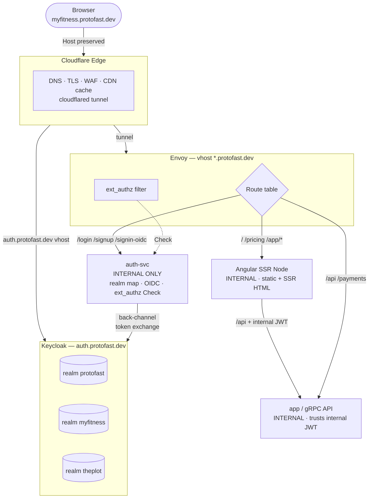
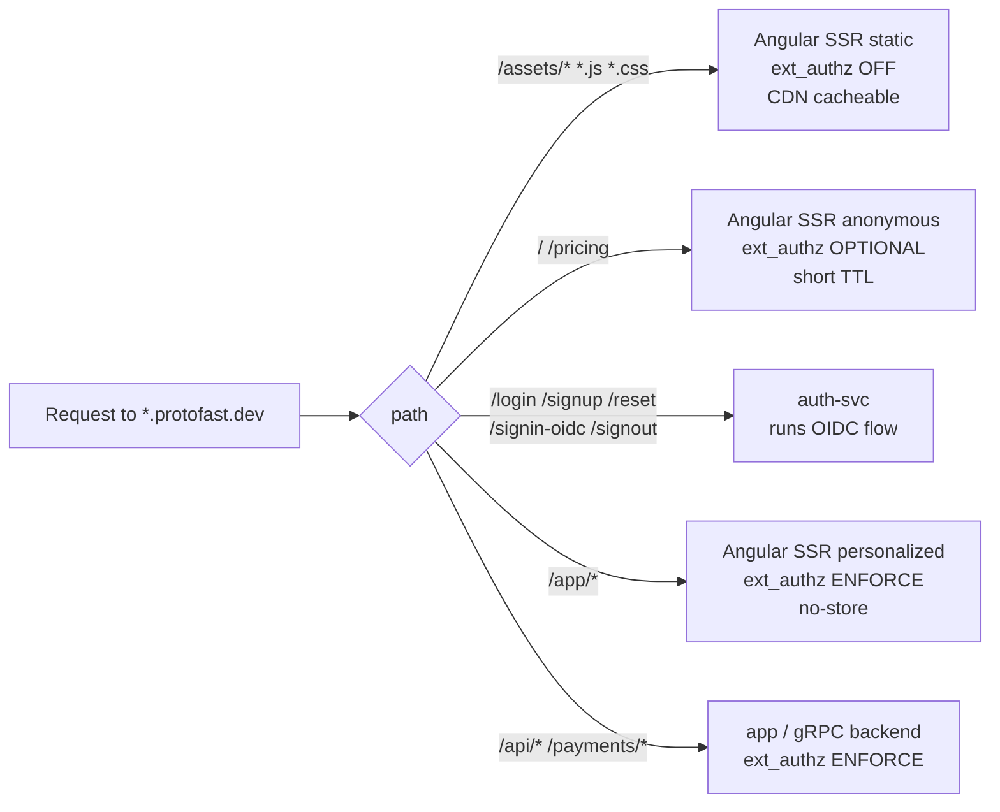
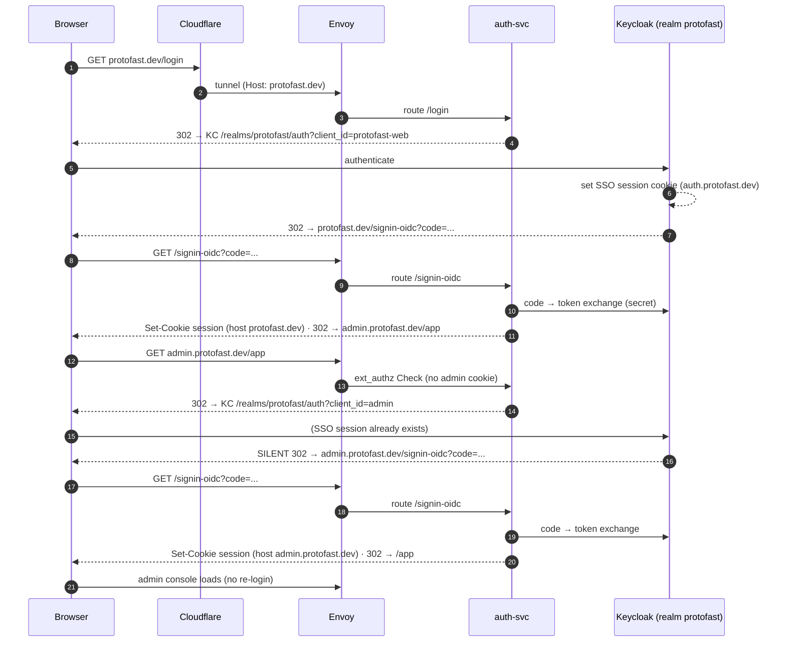
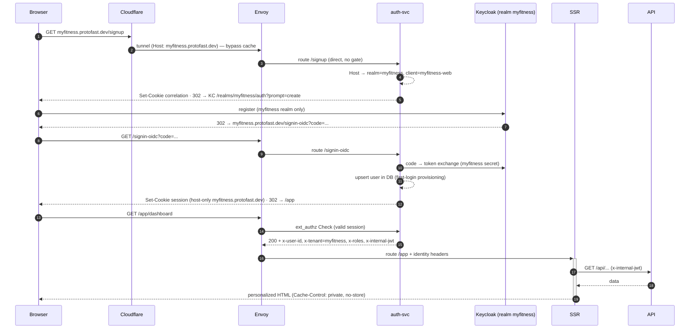
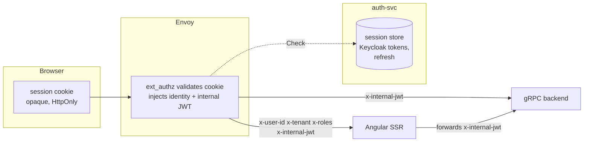

# Multi-Tenant Auth Architecture (Cloudflare → Envoy → Keycloak)

Edge-terminated, BFF-style authentication for multiple client domains under
`*.protofast.dev`, with **Envoy ext_authz** delegating to a central auth service that resolves tenant → Keycloak realm dynamically. Angular SSR renders identity-aware HTML; the browser only ever holds an opaque session cookie. 

## Components

| Component          | Host                                             | Role                                                             |
| ------------------ | ------------------------------------------------ | ---------------------------------------------------------------- |
| **Cloudflare**     | edge for `*.protofast.dev`, `auth.protofast.dev` | TLS termination, WAF, CDN, `cloudflared` tunnel to Envoy         |
| **Envoy**          | origin (behind tunnel)                           | Single wildcard vhost; `ext_authz` gate + route table            |
| **auth-svc**       | internal cluster only — **no public domain**     | tenant→realm map, OIDC flow, ext_authz `Check`, session issuance |
| **Angular SSR**    | internal upstream cluster                        | static bundles + anonymous + personalized SSR HTML               |
| **app / gRPC API** | internal upstream cluster                        | business backend; trusts injected internal JWT                   |
| **Keycloak**       | `auth.protofast.dev`                             | realms: `protofast`, `myfitness`, `theplot`                      |

> Only `*.protofast.dev` (client apps) and `auth.protofast.dev` (Keycloak) are
> publicly reachable through Cloudflare. **auth-svc, Angular SSR, and the API are
> internal-only** — reachable solely as Envoy upstream clusters / via ext_authz,
> never directly from the internet.

## Realm / client mapping

3 realms, 4 clients — staff share a realm; each product is isolated.

| Domain                    | Realm       | Client          | Users                 |
| ------------------------- | ----------- | --------------- | --------------------- |
| `protofast.dev`           | `protofast` | `protofast-web` | Root / public + staff |
| `admin.protofast.dev`     | `protofast` | `admin`         | Staff admin console   |
| `myfitness.protofast.dev` | `myfitness` | `myfitness-web` | Product tenant users  |
| `theplot.protofast.dev`   | `theplot`   | `theplot-web`   | Product tenant users  |

The realm/client map lives in **auth-svc data, not Envoy config** — adding a
tenant is a DB row, not a redeploy.

---

## Topology

---

## Route buckets (single wildcard vhost)

---

## Flow A — root user: sign in on `protofast.dev`, redirect to `admin`

Staff log in once; the admin console authenticates **silently** because both
clients share the `protofast` realm and Keycloak holds an SSO session.

---

## Flow B — tenant user: sign up on `myfitness.protofast.dev`

Realm-isolated. A `myfitness` session presented to `theplot.protofast.dev`
fails ext_authz → fresh login against the `theplot` realm.

> `SSR` = Angular SSR Node server, `API` = app / gRPC backend (omitted from the
> participant list above for brevity; both are Envoy upstreams).

---

## Identity & token relay (BFF)

The browser never sees a Keycloak token — only an opaque session cookie.

---

## Cloudflare cache rules

| Content                            | Cache?              | Directive                             |
| ---------------------------------- | ------------------- | ------------------------------------- |
| `/assets/*`, hashed `*.js`/`*.css` | Yes, long TTL       | `public, max-age=31536000, immutable` |
| `/`, `/pricing` (anonymous SSR)    | Cautious, short TTL | `public, max-age=60`, host-keyed      |
| `/app/*` (personalized SSR)        | **Never**           | `private, no-store`                   |
| any `Set-Cookie` response          | **Never**           | bypass                                |
| `/api/*`                           | **Never**           | `no-store`                            |

**Cache key must include `Host`** so tenants never share entries. Personalized
SSR + shared CDN cache = cross-user data leak if mis-set — this is the single
highest-risk item.

---

## Operational gotchas

1. **Host preservation through `cloudflared`** — ext_authz realm resolution
  depends entirely on the original `Host`; don't let the tunnel ingress
   rewrite it.
2. **Forwarded proto** — TLS terminates at Cloudflare, so Envoy/Keycloak/auth-svc
  must trust `X-Forwarded-Proto: https` to build `https://` redirect URIs.
   Keycloak: `KC_PROXY_HEADERS=xforwarded`, `KC_HOSTNAME=auth.protofast.dev`.
3. **SSR cache poisoning** — see cache table; emit `private, no-store` on
  personalized responses.
4. **WAF vs OIDC** — exclude `/signin-oidc` and the back-channel from bot/CAPTCHA
  challenges.
5. **Cookie attributes** — `Secure; HttpOnly; SameSite=Lax` (Lax required so the
  cookie survives the top-level redirect back from Keycloak; Strict would drop
   it).

---

## Why one vhost + ext_authz (vs vhost-per-tenant)

|                                 | vhost / tenant          | **1 vhost + ext_authz**    |
| ------------------------------- | ----------------------- | -------------------------- |
| Add a tenant                    | Envoy config push       | DB row                     |
| Realm selection                 | static per vhost        | dynamic per request (Host) |
| vhost-count scaling             | bounded                 | non-issue                  |
| public-but-identity-aware pages | awkward                 | natural                    |
| login/signup/reset logic        | spread in filter config | centralized in auth-svc    |
| cost                            | config only             | build & run auth-svc       |

