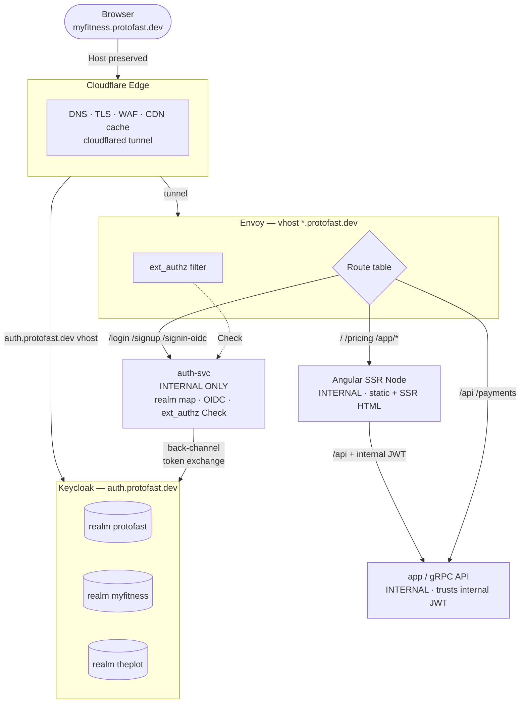
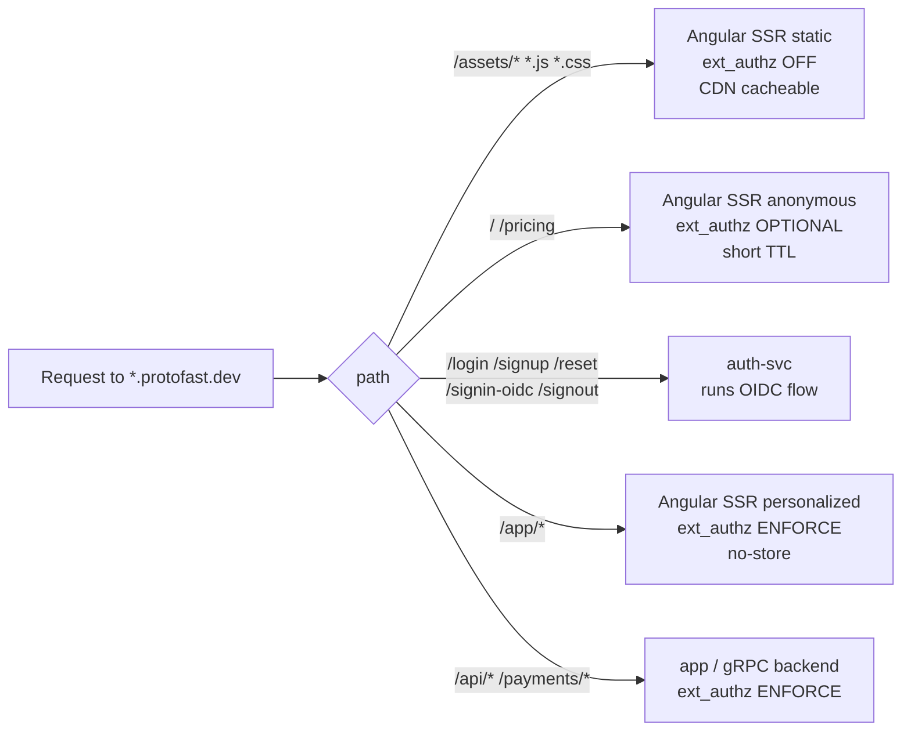
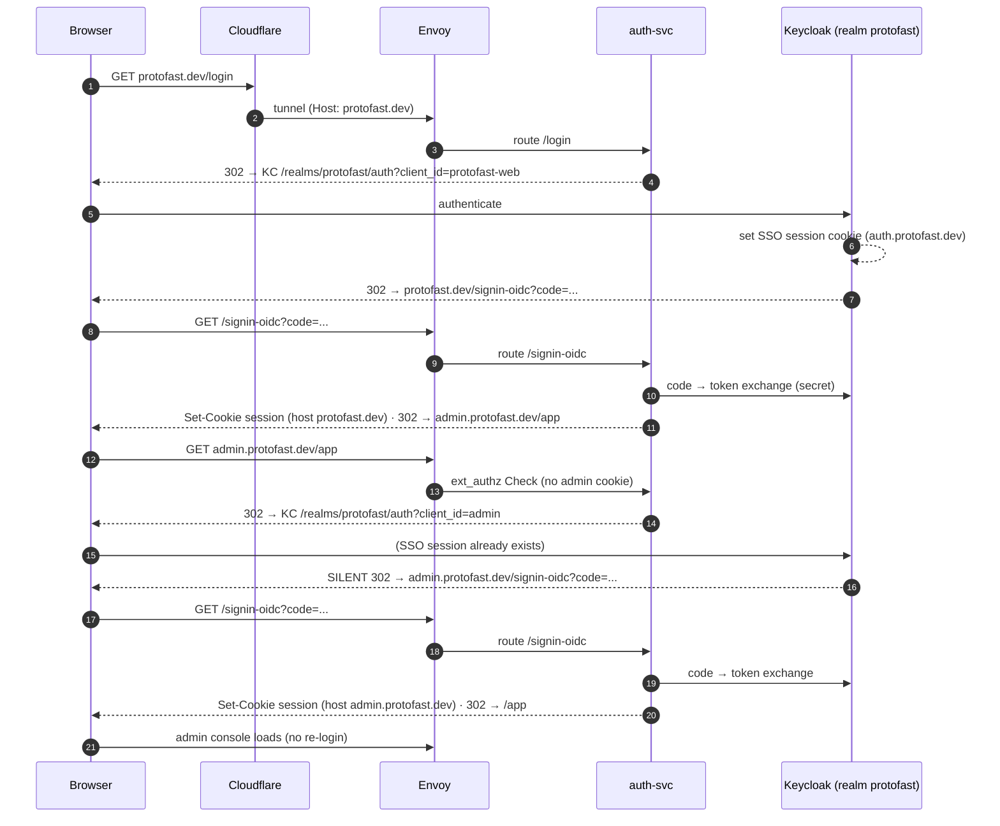
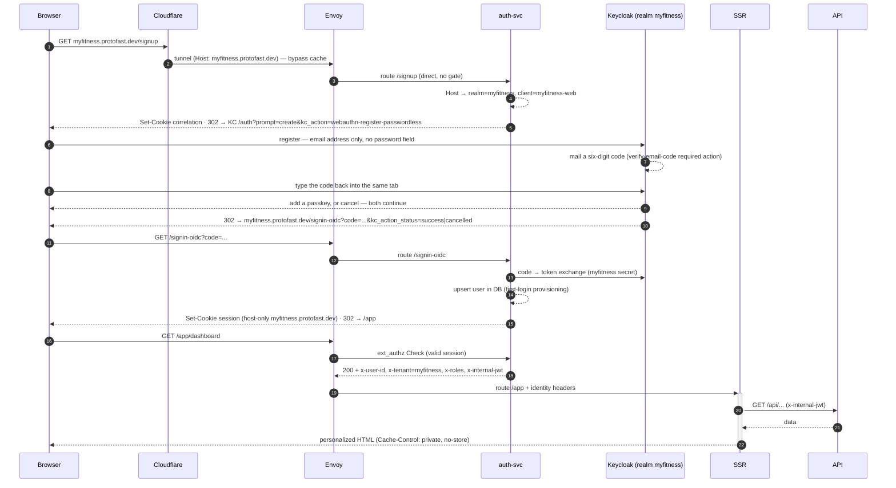
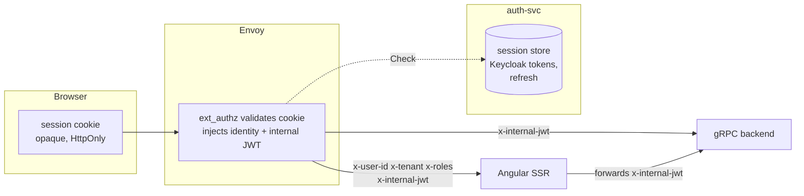

# Multi-Tenant Auth Architecture (Cloudflare → Envoy → Keycloak)

Edge-terminated, BFF-style authentication for multiple client domains under
`*.protofast.dev`, with **Envoy ext_authz** delegating to a central auth service that resolves tenant → Keycloak realm dynamically. Angular SSR renders identity-aware HTML; the browser only ever holds an opaque session cookie.

## Components

| Component          | Host                                             | Role                                                             |
| ------------------ | ------------------------------------------------ | ---------------------------------------------------------------- |
| **Cloudflare**     | edge for `*.protofast.dev`, `auth.protofast.dev` | TLS termination, WAF, CDN, `cloudflared` tunnel to Envoy         |
| **Envoy**          | origin (behind tunnel)                           | Single wildcard vhost; `ext_authz` gate + route table            |
| **auth-svc**       | internal cluster only — **no public domain**     | tenant→realm map, OIDC flow, ext_authz `Check`, session issuance |
| **Angular SSR**    | internal upstream cluster                        | static bundles + anonymous + personalized SSR HTML               |
| **app / gRPC API** | internal upstream cluster                        | business backend; trusts injected internal JWT                   |
| **Keycloak**       | `auth.protofast.dev`                             | realms: `protofast`, `myfitness`, `theplot`                      |

> Only `*.protofast.dev` (client apps) and `auth.protofast.dev` (Keycloak) are
> publicly reachable through Cloudflare. **auth-svc, Angular SSR, and the API are
> internal-only** — reachable solely as Envoy upstream clusters / via ext_authz,
> never directly from the internet.

## Realm / client mapping

3 realms, 4 clients — staff share a realm; each product is isolated.

| Domain                    | Realm       | Client          | Users                 |
| ------------------------- | ----------- | --------------- | --------------------- |
| `protofast.dev`           | `protofast` | `protofast-web` | Root / public + staff |
| `admin.protofast.dev`     | `protofast` | `admin`         | Staff admin console   |
| `myfitness.protofast.dev` | `myfitness` | `myfitness-web` | Product tenant users  |
| `theplot.protofast.dev`   | `theplot`   | `theplot-web`   | Product tenant users  |

The realm/client map lives in **auth-svc data, not Envoy config** — adding a
tenant is a DB row, not a redeploy.

---

## Topology

```mermaid
flowchart TB
    Browser([Browser<br/>myfitness.protofast.dev])

    subgraph CF[Cloudflare Edge]
        direction TB
        CFfeat[DNS · TLS · WAF · CDN cache<br/>cloudflared tunnel]
    end

    subgraph ENVOY[Envoy — vhost *.protofast.dev]
        direction TB
        EXT[ext_authz filter]
        ROUTER{Route table}
    end

    AUTH[auth-svc<br/>INTERNAL ONLY<br/>realm map · OIDC · ext_authz Check]
    SSR[Angular SSR Node<br/>INTERNAL · static + SSR HTML]
    API[app / gRPC API<br/>INTERNAL · trusts internal JWT]

    subgraph KC[Keycloak — auth.protofast.dev]
        direction LR
        R1[(realm protofast)]
        R2[(realm myfitness)]
        R3[(realm theplot)]
    end

    Browser -->|Host preserved| CF
    CF -->|tunnel| ENVOY
    EXT -.->|Check| AUTH
    ROUTER -->|/login /signup /signin-oidc| AUTH
    ROUTER -->|/ /pricing /app/*| SSR
    ROUTER -->|/api /payments| API
    SSR -->|/api + internal JWT| API
    AUTH -->|back-channel<br/>token exchange| KC
    CF -->|auth.protofast.dev vhost| KC
```

---

## Route buckets (single wildcard vhost)

```mermaid
flowchart LR
    REQ[Request to *.protofast.dev] --> R{path}
    R -->|/assets/* *.js *.css| STATIC[Angular SSR static<br/>ext_authz OFF<br/>CDN cacheable]
    R -->|/ /pricing| PUB[Angular SSR anonymous<br/>ext_authz OPTIONAL<br/>short TTL]
    R -->|/login /signup /reset<br/>/signin-oidc /signout| OIDC[auth-svc<br/>runs OIDC flow]
    R -->|/app/*| PROT[Angular SSR personalized<br/>ext_authz ENFORCE<br/>no-store]
    R -->|/api/* /payments/*| BACK[app / gRPC backend<br/>ext_authz ENFORCE]
```

---

## Flow A — root user: sign in on `protofast.dev`, redirect to `admin`

Staff log in once, and the admin console authenticates off the realm SSO session
both clients share.

**It is no longer silent, and must not be.** With no password in the realm, a
sign-in that is silent from the admin console's point of view means the admin
console is reachable with a mailbox and nothing else, for as long as the SSO
session lives. Three things narrow that, in increasing order of cost:

1. **Short client sessions on `admin`** — `client.session.idle.timeout` and
   `client.session.max.lifespan` well below the realm's, so the window is
   minutes rather than a week.
2. **`max_age` on the admin client's authorize request**
   (`Tenants__ByHost__admin.protofast.dev__MaxAge`), which turns step 6 below
   from a silent redirect into a real prompt. On its own that prompt can still
   be answered with an emailed code.
3. **ACR step-up** (`…__AcrValues=passkey`), which routes the admin client
   through the realm's level-2 branch and demands a passkey specifically. This is
   the one that closes the gap, and the one gated on staff actually having
   passkeys and on a written break-glass procedure — turn it on before both are
   true and the admin console locks.

Step-up narrows the gap rather than closing it: an attacker holding the mailbox
signs in at the low level, hits the admin gate with no passkey, and can enrol one
on the spot through the same offer the product uses. Closing *that* needs one of
— requiring an existing passkey to enrol another on a privileged account,
granting admin roles only after a passkey exists, or accepting the mailbox as the
root of trust and hardening it (staff mail on a provider with enforced
hardware-key 2SV). The last is unglamorous and probably right for a team this
size.

The diagram below shows the unhardened path; step 6 is the one the three measures
above act on.

```mermaid
sequenceDiagram
    autonumber
    participant B as Browser
    participant CF as Cloudflare
    participant E as Envoy
    participant A as auth-svc
    participant KC as Keycloak (realm protofast)

    B->>CF: GET protofast.dev/login
    CF->>E: tunnel (Host: protofast.dev)
    E->>A: route /login
    A-->>B: 302 → KC /realms/protofast/auth?client_id=protofast-web
    B->>KC: authenticate
    KC-->>KC: set SSO session cookie (auth.protofast.dev)
    KC-->>B: 302 → protofast.dev/signin-oidc?code=...
    B->>E: GET /signin-oidc?code=...
    E->>A: route /signin-oidc
    A->>KC: code → token exchange (secret)
    A-->>B: Set-Cookie session (host protofast.dev) · 302 → admin.protofast.dev/app
    B->>E: GET admin.protofast.dev/app
    E->>A: ext_authz Check (no admin cookie)
    A-->>B: 302 → KC /realms/protofast/auth?client_id=admin
    B->>KC: (SSO session already exists)
    KC-->>B: SILENT 302 → admin.protofast.dev/signin-oidc?code=...
    B->>E: GET /signin-oidc?code=...
    E->>A: route /signin-oidc
    A->>KC: code → token exchange
    A-->>B: Set-Cookie session (host admin.protofast.dev) · 302 → /app
    B->>E: admin console loads (no re-login)
```

---

## Flow B — tenant user: sign up on `myfitness.protofast.dev`

Realm-isolated. A `myfitness` session presented to `theplot.protofast.dev`
fails ext_authz → fresh login against the `theplot` realm.

```mermaid
sequenceDiagram
    autonumber
    participant B as Browser
    participant CF as Cloudflare
    participant E as Envoy
    participant A as auth-svc
    participant KC as Keycloak (realm myfitness)

    B->>CF: GET myfitness.protofast.dev/signup
    CF->>E: tunnel (Host: myfitness.protofast.dev) — bypass cache
    E->>A: route /signup (direct, no gate)
    A-->>A: Host → realm=myfitness, client=myfitness-web
    A-->>B: Set-Cookie correlation · 302 → KC /auth?prompt=create&kc_action=webauthn-register-passwordless
    B->>KC: register — email address only, no password field
    KC-->>KC: mail a six-digit code (verify-email-code required action)
    B->>KC: type the code back into the same tab
    KC-->>B: add a passkey, or cancel — both continue
    KC-->>B: 302 → myfitness.protofast.dev/signin-oidc?code=...&kc_action_status=success|cancelled
    B->>E: GET /signin-oidc?code=...
    E->>A: route /signin-oidc
    A->>KC: code → token exchange (myfitness secret)
    A-->>A: upsert user in DB (first-login provisioning)
    A-->>B: Set-Cookie session (host-only myfitness.protofast.dev) · 302 → /app
    B->>E: GET /app/dashboard
    E->>A: ext_authz Check (valid session)
    A-->>E: 200 + x-user-id, x-tenant=myfitness, x-roles, x-internal-jwt
    E->>+SSR: route /app + identity headers
    SSR->>API: GET /api/... (x-internal-jwt)
    API-->>SSR: data
    SSR-->>-B: personalized HTML (Cache-Control: private, no-store)
```

> `SSR` = Angular SSR Node server, `API` = app / gRPC backend (omitted from the
> participant list above for brevity; both are Envoy upstreams).

The code is typed rather than clicked because a link strands people: registering
on a laptop and opening the mail on a phone proves the address but mints the
session on the phone, where the user is not. A code is readable anywhere and
typed where you started. It also makes link-prefetching mail scanners harmless.

The passkey offer is an Application Initiated Action on an ordinary authorize
request, and cancelling it does not fail the sign-in. It is made at the end of
the sign-in itself because that is the only moment the user is definitely present
and definitely finished — no banner, no dashboard card, no settings nudge. A user
who cancels is asked again at their next sign-in, and session lifetime is the
whole of the cadence.

**Sign-up carries the action on its own authorize request; sign-in chains it onto
a second one.** That asymmetry is Keycloak's, not ours. After a sign-in the SSO
cookie satisfies the follow-up authorize silently, so the second round trip costs
two redirects and nothing else. After a *registration* it does not: registration
is a different top-level flow and records no authenticated level against the
browser flow, so Keycloak's Cookie authenticator answers the follow-up with
"strong authentication required" and drops the brand-new account into the sign-in
branch — which, in a realm whose only other credential is a mailed code, means a
second code seconds after the one that just verified the address. Putting
`kc_action` on the registration request itself runs the offer as the last step of
the flow the user is already in.

That only covers registrations that start at `/signup`. The realm allows
registration, so Keycloak's own **"New user? Register"** link on the login page
reaches the same callback by way of `/signin` — with no offer aboard, which used
to chain one and buy exactly the second code described above. **The callback
therefore never chains the offer onto a first login**: the account was created by
this very callback, so whatever the browser did to get here, it did not leave a
level behind on the browser flow. The offer waits for their next sign-in, where
the cookie satisfies it silently — the same cadence a user who cancels is on.

Two corollaries. The level a follow-up authorize demands is the higher of the
client's `acr_values` and the level the `kc_action` itself implies, so this
happens even on the product host, which asks for no ACR at all. And a brand-new
account that taps **Add a passkey** on the subscribe or account page pays the same
second code, because `/add-passkey` is that same raised-level authorize; a user
who *signed in* does not, since `basic-level-of-authentication` carries a
`loa-max-age` of seven days.

---

## Identity & token relay (BFF)

The browser never sees a Keycloak token — only an opaque session cookie.

```mermaid
flowchart LR
    subgraph Browser
        C[session cookie<br/>opaque, HttpOnly]
    end
    subgraph Envoy
        X[ext_authz validates cookie<br/>injects identity + internal JWT]
    end
    subgraph auth-svc
        S[(session store<br/>Keycloak tokens,<br/>refresh)]
    end
    C --> X
    X -.Check.-> S
    X -->|x-user-id x-tenant x-roles<br/>x-internal-jwt| SSR[Angular SSR]
    X -->|x-internal-jwt| API[gRPC backend]
    SSR -->|forwards x-internal-jwt| API
```

---

## Cloudflare cache rules

| Content                            | Cache?              | Directive                             |
| ---------------------------------- | ------------------- | ------------------------------------- |
| `/assets/*`, hashed `*.js`/`*.css` | Yes, long TTL       | `public, max-age=31536000, immutable` |
| `/`, `/pricing` (anonymous SSR)    | Cautious, short TTL | `public, max-age=60`, host-keyed      |
| `/app/*` (personalized SSR)        | **Never**           | `private, no-store`                   |
| any `Set-Cookie` response          | **Never**           | bypass                                |
| `/api/*`                           | **Never**           | `no-store`                            |

**Cache key must include `Host`** so tenants never share entries. Personalized
SSR + shared CDN cache = cross-user data leak if mis-set — this is the single
highest-risk item.

---

## Operational gotchas

1. **Host preservation through `cloudflared`** — ext_authz realm resolution
  depends entirely on the original `Host`; don't let the tunnel ingress
   rewrite it.
2. **Forwarded proto** — TLS terminates at Cloudflare, so Envoy/Keycloak/auth-svc
  must trust `X-Forwarded-Proto: https` to build `https://` redirect URIs.
   Keycloak: `KC_PROXY_HEADERS=xforwarded`, `KC_HOSTNAME=https://auth.protofast.dev` (full URL — a bare hostname makes Keycloak resolve the issuer per request, so the back-channel refresh_token grant sees a different issuer than the browser login stamped into the token).
3. **SSR cache poisoning** — see cache table; emit `private, no-store` on
  personalized responses.
4. **WAF vs OIDC** — exclude `/signin-oidc` and the back-channel from bot/CAPTCHA
  challenges.
5. **Cookie attributes** — `Secure; HttpOnly; SameSite=Lax` (Lax required so the
  cookie survives the top-level redirect back from Keycloak; Strict would drop
   it).

---

## Why one vhost + ext_authz (vs vhost-per-tenant)

|                                 | vhost / tenant          | **1 vhost + ext_authz**    |
| ------------------------------- | ----------------------- | -------------------------- |
| Add a tenant                    | Envoy config push       | DB row                     |
| Realm selection                 | static per vhost        | dynamic per request (Host) |
| vhost-count scaling             | bounded                 | non-issue                  |
| public-but-identity-aware pages | awkward                 | natural                    |
| login/signup/reset logic        | spread in filter config | centralized in auth-svc    |
| cost                            | config only             | build & run auth-svc       |

