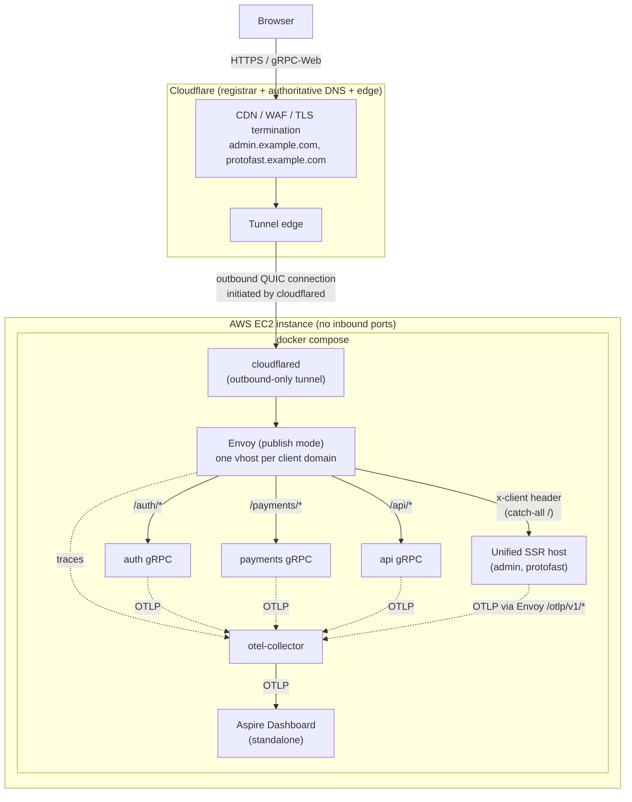
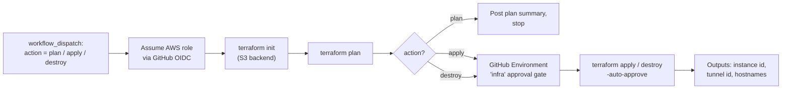
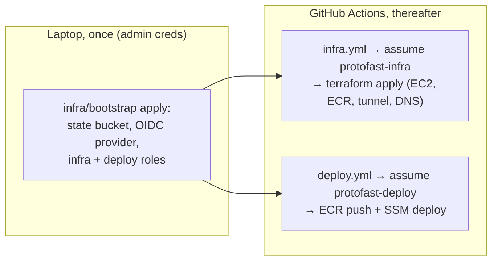
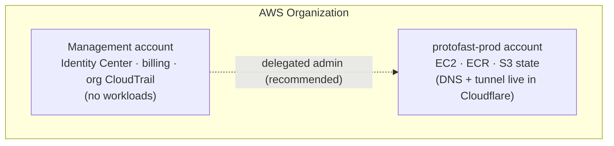
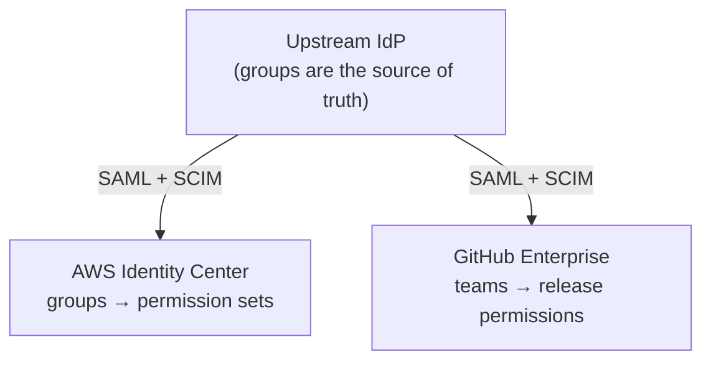
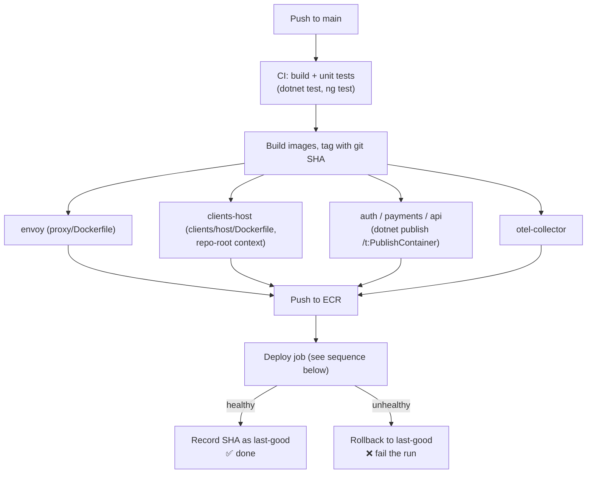
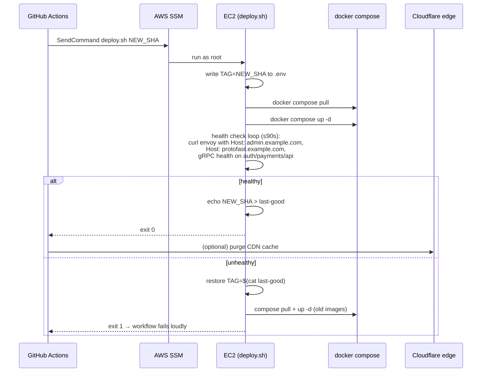
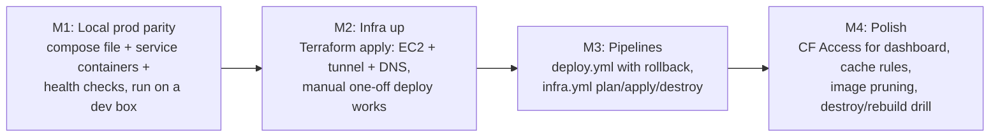

# ProtoFast Deployment Plan

Goal: a single-origin production deployment of the ProtoFast stack (Envoy front
proxy, unified Angular SSR host, .NET gRPC services, OTel collector) on one AWS
EC2 instance, fronted by Cloudflare's CDN via a Cloudflare Tunnel, with
GitHub Actions providing both infrastructure lifecycle (build / update /
destroy) and application deployments (deploy → health check → rollback).

The domain is **registered in Cloudflare and Cloudflare is authoritative** for
its DNS — there is no Route 53 / AWS DNS involvement at all.

No blue/green or A/B is required. One environment, one instance, boring and
reproducible.

---

## 1. Target runtime architecture



Key properties:

- **Zero inbound ports on the EC2 instance.** `cloudflared` dials out to
  Cloudflare; the security group allows no ingress at all. Admin access is via
  AWS SSM Session Manager, not SSH.
- **Envoy runs in its existing `publish` mode** ([proxy/entrypoint.sh](../proxy/entrypoint.sh)):
  one listener, one virtual host per client domain
  (`CLIENT_<NAME>_DOMAIN`), all catch-all traffic routed to the unified SSR
  host with the `x-client` header — exactly what
  [clients/host/server.mjs](../clients/host/server.mjs) expects.
- **Telemetry** starts as the standalone Aspire Dashboard container
  (`mcr.microsoft.com/dotnet/aspire-dashboard`) fed by the existing
  otel-collector. It is in-memory/ephemeral — fine as a starting point, to be
  replaced later (see §8).

---

## 2. Resolved unknowns

### 2.1 DNS: Cloudflare is registrar and authoritative

The domain is **registered in Cloudflare and Cloudflare is authoritative** for
the zone. There is no Route 53, no AWS-side DNS, and no NS delegation step —
AWS hosts only the compute (EC2/ECR), nothing DNS-related.

This is the simplest possible setup for this architecture:

- Cloudflare's CDN proxying (orange-cloud) and Tunnel public hostnames work
  natively on the **Free plan** when Cloudflare is authoritative — the
  Business-plan "partial / CNAME setup" caveat does not apply.
- The Cloudflare zone hosts all DNS records.
- Tunnel public hostnames auto-create `CNAME <host> → <tunnel-id>.cfargotunnel.com`
  records in the zone.

Terraform manages the zone, its records, and the tunnel via the Cloudflare
provider. Domain *registration/transfer* into Cloudflare Registrar is a
one-time manual step (Cloudflare Registrar has no Terraform create resource);
once the domain is in the account, everything else is code. No AWS IAM
permissions for `route53*` are needed anywhere (see §3.3, §3.4).

### 2.2 TLS: certbot is not needed at all

This was flagged as an unknown — the answer is that the tunnel architecture
eliminates it:

| Hop | Encryption | Certificate |
|---|---|---|
| Browser → Cloudflare edge | HTTPS | Cloudflare Universal SSL (automatic, free, auto-renewing) |
| Cloudflare edge → origin | QUIC tunnel | Tunnel credentials (`cloudflared` token), not a certificate |
| `cloudflared` → Envoy (in-host) | Docker network hop | Optional (see below) |

No certbot, no ACME, no renewal cron, no port 80 challenge. The origin never
terminates public TLS.

One wrinkle: [proxy/entrypoint.sh](../proxy/entrypoint.sh) currently requires
`ENVOY_TLS_CERT` / `ENVOY_TLS_KEY` unconditionally, so the Envoy container
expects to terminate TLS even in publish mode. Two options:

1. **(Simplest)** Bake/generate a long-lived self-signed cert for the internal
   hop and point `cloudflared` at `https://envoy:8443` with
   `originRequest.noTLSVerify: true` (traffic never leaves the Docker
   network).
2. Add a plain-HTTP variant of the publish listener and have `cloudflared`
   target `http://envoy:8080`.

Option 1 requires no Envoy template changes — recommended for v1.

### 2.3 "docker compose or better"

Recommendation: **plain docker compose**, with one enhancement worth
evaluating — Aspire 9.x can *generate* the compose file from the AppHost
(`AddDockerComposeEnvironment` + `aspire publish`). Since
[apphost/Program.cs](../apphost/Program.cs) already models the whole topology
(including publish mode), generating compose from it keeps dev and prod from
drifting. If the generated output fights us, fall back to a hand-written
`deploy/docker-compose.yml` that mirrors the AppHost wiring.

Docker Swarm single-node would give built-in rolling updates and
`docker service rollback`, but it adds a second orchestration model for
marginal benefit on one instance. Compose + explicit rollback (see §5) is
simpler and sufficient given no A/B requirement.

---

## 3. Infrastructure as code

**Tool: Terraform** (or OpenTofu — interchangeable here), because the
build / update / destroy requirement is exactly `apply` / `apply` / `destroy`,
and both AWS and Cloudflare have first-class providers.

### 3.1 Resources

| Layer | Resources |
|---|---|
| State | S3 bucket for Terraform state with native lockfile (`use_lockfile`) — created once, manually or via a tiny bootstrap config |
| AWS | VPC (or default VPC), EC2 instance (e.g. `t3.medium`/ARM `t4g.medium`, Ubuntu 24.04), security group (egress-only), IAM instance profile (SSM core + ECR pull), ECR repositories (envoy, clients-host, auth, payments, api, otel-collector), EBS volume, cloud-init `user_data` |
| AWS (CI identity) | IAM OIDC provider for GitHub Actions + role assumable by this repo (no long-lived keys in GitHub secrets) |
| Cloudflare | Zone (data-source — domain already registered + authoritative in Cloudflare), Tunnel (`cloudflare_zero_trust_tunnel_cloudflared`), tunnel config (public hostnames → `https://envoy:8443`), DNS CNAME records per client domain, zone settings (Always HTTPS, TLS mode) |

`user_data` (cloud-init) does the one-time instance setup: install Docker +
compose plugin, create `/opt/protofast/`, write the tunnel token to a root-only
file, enable SSM agent. Everything after boot is driven by deployments, so the
instance is cattle: `terraform destroy && apply` rebuilds it from nothing, and
the next deploy repopulates it.

### 3.2 Infra lifecycle via GitHub Actions



- Workflow: `.github/workflows/infra.yml`, manual `workflow_dispatch` with an
  `action` input. **Updates are just `apply`** after editing `infra/*.tf` —
  Terraform diffs and converges, satisfying the "update if possible"
  requirement.
- `apply` and `destroy` run in a GitHub *Environment* with required reviewers,
  so destroy is deliberate, never accidental.
- Secrets: `CLOUDFLARE_API_TOKEN` (zone + tunnel scoped) in GitHub secrets;
  AWS via OIDC role, no stored keys.

### 3.3 One-time bootstrap (chicken-and-egg)

`infra.yml` needs an IAM OIDC role to authenticate and an S3 bucket for state —
neither exists until something creates them. A minimal bootstrap config,
`infra/bootstrap/`, is applied **once, locally, with admin credentials** and
never runs in CI. It uses local state (gitignored); all four resources are
trivially re-importable if that state is ever lost.

It creates:

1. **S3 state bucket** (versioned) for the main `infra/` config's backend.
2. **IAM OIDC provider** for `token.actions.githubusercontent.com`.
3. **Two roles**, least-privilege, trust-scoped to this repo. The repo slug is
   **not hard-coded** — the bootstrap reads it from git at apply time and takes
   it as a Terraform input variable `github_repo`:
   ```hcl
   variable "github_repo" {
     description = "owner/repo for the GitHub OIDC trust policy"
     # default derived at apply: gh repo view --json nameWithOwner -q .nameWithOwner
   }
   ```
   so the same config works for a fork or a rename with no edit.
   - `protofast-infra` — broad (EC2, VPC, IAM, ECR-create); no `route53*` —
     DNS lives entirely in Cloudflare;
     trust condition requires the `infra` GitHub Environment, so only
     approval-gated runs can assume it (the `sub` interpolates `var.github_repo`):
     ```json
     "StringLike": {
       "token.actions.githubusercontent.com:sub":
         "repo:${var.github_repo}:environment:infra"
     }
     ```
   - `protofast-deploy` — narrow (ECR push to the six repos,
     `ssm:SendCommand` scoped by instance tag); trusted for
     `repo:${var.github_repo}:ref:refs/heads/main`.
4. **GitHub repo config** — role ARNs as repo variables;
   `CLOUDFLARE_API_TOKEN` as the only stored secret.



---

### 3.4 Human access model — AWS Identity Center

Human AWS access is via **Identity Center (SSO)**, never IAM users or static
keys. The CLI is configured with `aws configure sso`, which issues
short-lived, auto-refreshing role credentials per profile. This is a separate
identity plane from the **machine** identities in §3.3 — the GitHub OIDC roles
(`protofast-infra`, `protofast-deploy`) authenticate CI; the groups below
authenticate people. The two are kept deliberately parallel: the human
`PlatformAdmin` mirrors what `protofast-infra` can do, `Deployer` mirrors
`protofast-deploy`, so a person can reproduce by hand exactly what a pipeline
does — no more.

Identity Center implies a small **AWS Organization**:



#### Groups → permission sets → accounts

The deliberate split: **no single group is admin over everything.** Workload
power (`Platform-Admins`, scoped to `protofast-prod`) and org/identity power
(`Org-Admins`, scoped to the management account) are held by different groups,
so compromising one does not yield the other. Daily work happens in the
lower-privilege groups; the two admin groups are deliberately small.

| Group | Purpose | Permission set | Account(s) | Session |
|---|---|---|---|---|
| **Org-Admins** | Manage the org, Identity Center, account creation. Break-glass. NOT for workload changes. | `OrgAdmin` (AdministratorAccess) | Management | 1h, MFA, monitored |
| **Platform-Admins** | Run §3.3 bootstrap, own Terraform infra, networking, IAM-of-the-app | `PlatformAdmin` (custom + boundary) | protofast-prod | 4h, MFA |
| **Deploy-BreakGlass** | Emergency manual deploy/rollback **only when CI is unavailable**. Not used for normal releases. | `Deployer` (custom) | protofast-prod | 1h, MFA |
| **Developers** | Debug prod: read logs, SSM shell, pull images. No mutation. | `Developer` (custom) | protofast-prod | 8h |
| **FinOps** | Cost & billing visibility | `Billing` (managed) | Management | 8h |
| **Security** | Read-only audit across accounts | `SecurityAudit` (managed) | All | 8h |

#### Permission set contents

- **`OrgAdmin`** — `AdministratorAccess`, but *scoped to the management
  account only*. This is the unavoidable top-level admin; it's break-glass
  (small membership, MFA, CloudTrail-alerted), not a daily driver, and it has
  no standing presence in the workload account.
- **`PlatformAdmin`** — custom policy: full `ec2`, `vpc`, `ecr`, `s3` (state
  bucket), `ssm`, `cloudwatch`, `logs`, and `iam` **constrained by a
  permissions boundary** so it cannot create or
  attach roles more privileged than itself (no privilege escalation). Explicit
  `Deny` on `organizations:*` and `account:*` — infra admins can't touch the
  org. This is the group that runs the local bootstrap apply.
- **`Deployer`** — `ecr:*` on the six app repos only; `ssm:SendCommand`
  scoped by resource tag to the prod instance + the deploy document;
  `ssm:StartSession`; read-only `ec2:Describe*`, `logs:Get*/FilterLogEvents`;
  read-only (no write) on the S3 state bucket. No `iam:*`, no infra mutation.
  **This is break-glass.** A normal release is a GitHub action run by the
  `protofast-deploy` OIDC role (§3.3) — no human assumes this set during
  routine deploys. It exists only for when CI is down and someone must invoke
  the deploy script by hand. Membership is small (typically a subset of
  Platform-Admins).
- **`Developer`** — AWS-managed `ViewOnlyAccess` + `ssm:StartSession` to the
  prod instance (debug shell) + `logs` read + `ecr` pull. No `SendCommand`, no
  writes anywhere.
- **`Billing`** — AWS-managed `Billing` + Cost Explorer read.
- **`SecurityAudit`** — AWS-managed `SecurityAudit` + `ViewOnlyAccess`,
  assigned across all accounts for org-wide read.

#### Who can release? (GitHub, not AWS)

A normal release is performed by **GitHub Actions** (the `protofast-deploy`
OIDC role), not by a person assuming an AWS group. So "who may release" is a
**GitHub** permission, governed entirely on the GitHub side:

| Capability | Controlled by (GitHub) |
|---|---|
| Trigger a deploy by merging | Branch protection on `main` — who may merge |
| Redeploy / roll back a specific SHA | Who may run `workflow_dispatch` on `deploy.yml` |
| Release infra changes | Required reviewers on the `infra` Environment |

No AWS group grants the ability to release. The AWS `Deployer` set above is
the break-glass exception, used only when GitHub itself is unavailable.

#### Tying GitHub identities to AWS groups

You **cannot** (and should not) authorize individual GitHub *users* into AWS
via the OIDC trust policy — the OIDC `sub` claim identifies the
*workflow/repo/environment*, a machine identity, not the human who triggered
it. To make one person map to consistent access in both systems, federate
both to a **common upstream IdP** (Entra ID / Okta / Google Workspace):



SCIM syncs the same IdP group into both an Identity Center group **and** a
GitHub team, so one membership change governs both planes. Without an external
IdP (small team), maintain the two memberships in parallel by hand — the
mapping is the same, just not auto-synced.

#### Notes

- **Permissions boundary** (`protofast-boundary`) is created once in the
  bootstrap (§3.3) and attached by `PlatformAdmin`-created roles — it's what
  keeps the infra-admin group from escalating via IAM.
- **Delegated administration**: register `protofast-prod` (or a dedicated
  `security` account) as the Identity Center delegated admin so day-to-day
  SSO management doesn't require logging into the management account.
- **MFA enforced** org-wide in Identity Center settings; admin sets use the
  shortest sessions.
- A user typically lands in 1–2 groups (e.g. a developer who also releases is
  in `Developers` + `Release-Engineers`); permissions are the union, but each
  set remains independently minimal.

#### Provisioning this model — can Terraform create the SSO groups?

Short answer: **it depends on the Identity Center identity source**, and the
split decides what has to live in the repo. The fork is entirely about
**groups** — permission sets and account assignments are code *either way*.

| Object | Terraform resource | Creatable by Terraform? |
|---|---|---|
| Identity Center instance (enabling IC) | — | **No.** One-time manual enablement in the Organizations / Identity Center console. Referenced afterward via `data.aws_ssoadmin_instances`. |
| Identity source / SCIM configuration | — | **No.** Console-only. |
| Permission sets + policies + boundary | `aws_ssoadmin_permission_set`, `_managed_policy_attachment`, `_customer_managed_policy_attachment`, `_permission_set_inline_policy`, `_permissions_boundary_attachment` | **Yes, always.** |
| Account assignments (group → permission set → account) | `aws_ssoadmin_account_assignment` | **Yes, always.** |
| Groups, users, memberships | `aws_identitystore_group`, `aws_identitystore_user`, `aws_identitystore_group_membership` | **Only when the identity source is the built-in "Identity Center directory."** With an external IdP (Entra/Okta/Google) over SCIM, groups and users are **SCIM-provisioned and read-only** to AWS — Terraform can only *reference* them via `data.aws_identitystore_group`. |

This gives two concrete branches, and the repo must support whichever is chosen.

**Branch A — built-in Identity Center directory (recommended for v1 / small team).**
Terraform owns the whole model: `aws_identitystore_group` creates the six groups,
`aws_ssoadmin_permission_set` creates the six sets, and
`aws_ssoadmin_account_assignment` wires group → set → account. The entire §3.4
table becomes `apply`-able — this supersedes the earlier "maintain the two
memberships by hand" note, since memberships are now code too.

**Branch B — external IdP + SCIM.**
Groups/users are created upstream and pushed into Identity Center by SCIM; AWS
treats them as read-only. The repo therefore carries:
- the **permission-set definitions** (policy JSON) and the
  **group → set → account assignment matrix**, applied by Terraform, which looks
  up each SCIM group with `data.aws_identitystore_group` (by display name);
- a documented **manual step**: a human (or HR sync) creates the groups in the
  IdP, *then* `terraform apply` binds them — i.e. "create the groups, then
  upload."

Either way the permission-set policies are version-controlled; the only thing
that differs is whether the six group objects are `resource` (Branch A) or
`data` (Branch B).

#### Who runs the Identity Center config, and the permission set they need

Identity Center lives in the **management account**, so this config runs there
(or in a delegated-admin account) and is driven by a **human, never the CI OIDC
roles** — those are scoped to `protofast-prod` and have no identity reach. It is
bootstrap-shaped: rare, high blast radius, manual `terraform apply`. It lives in
its own root config, `infra/identity-center/` (separate state from the workload
`infra/`), so an identity change can never be entangled with an app-infra plan.

The runner uses `OrgAdmin` (break-glass, AdministratorAccess) the **first** time,
because creating the first permission set requires pre-existing SSO admin rights.
Thereafter a tighter, version-controlled permission set —
**`IdentityCenterAdmin`** — is sufficient. Its policy is checked in at
`infra/identity-center/policies/identity-center-admin.json` and needs:

```json
{
  "Version": "2012-10-17",
  "Statement": [
    { "Sid": "ManagePermissionSets", "Effect": "Allow",
      "Action": ["sso:*", "sso-directory:*"], "Resource": "*" },
    { "Sid": "ManageGroupsAndUsers", "Effect": "Allow",
      "Action": ["identitystore:*"], "Resource": "*" },
    { "Sid": "ReadOrgForAssignments", "Effect": "Allow",
      "Action": ["organizations:Describe*", "organizations:List*"], "Resource": "*" },
    { "Sid": "ServiceLinkedRole", "Effect": "Allow",
      "Action": ["iam:CreateServiceLinkedRole", "iam:GetRole", "iam:ListRoles"],
      "Resource": "*" },
    { "Sid": "DirectoryRead", "Effect": "Allow",
      "Action": ["ds:DescribeDirectories"], "Resource": "*" }
  ]
}
```

Notes on this policy:
- Tighten `sso:*` / `identitystore:*` to the explicit
  `Create*/Put*/Attach*/Provision*/Describe*/List*` verbs once the operation set
  is stable.
- In **Branch B**, drop `identitystore:Create*`/`UpdateGroup`/`DeleteGroup` —
  groups are SCIM-owned and read-only; only `Describe*/List*` are used.
- Provisioning permission sets *into* member accounts is performed by the
  Identity Center service itself, so the runner needs **no** direct `iam:*` in
  `protofast-prod`. The `iam:CreateServiceLinkedRole` above is only for the
  one-time `AWSServiceRoleForSSO` in the management account.

So "the permissions needed" are in the repo regardless of branch: the
permission-set policy JSON for every group (`OrgAdmin`, `PlatformAdmin`,
`Deployer`, `Developer`, `Billing`, `SecurityAudit`) **and** the
`IdentityCenterAdmin` policy for whoever runs the Terraform that installs them.

## 4. Application deployment pipeline

Trigger: push to `main` (plus `workflow_dispatch` for redeploys / pinned-tag
deploys).



Notes:

- The .NET services have no Dockerfiles today; the .NET SDK's built-in
  container publish (`dotnet publish /t:PublishContainer`) avoids writing
  three near-identical Dockerfiles. If we ever need more control, swap in
  Dockerfiles per service.
- The clients-host image already exists ([clients/host/Dockerfile](../clients/host/Dockerfile))
  and must be built with the **repo root** as context (buf codegen reads
  `services/*/Protos`).
- ECR over GHCR: the EC2 instance profile grants pulls with zero credentials
  on the box.

### 4.1 Deploy + rollback mechanics

Deployment reaches the instance through **AWS SSM Run Command** — no SSH, no
inbound ports, and the GitHub OIDC role only needs `ssm:SendCommand` scoped to
the instance tag.

On the instance, `/opt/protofast/` holds:

- `docker-compose.yml` (synced by the deploy job)
- `.env` containing `TAG=<git-sha>` — every image reference in the compose
  file is `<ecr>/<image>:${TAG}`
- `last-good` file containing the last SHA that passed health checks



Why this rollback design works:

- **Atomic unit = the image tag set.** One `TAG` for all images means the
  stack rolls forward and back as a whole — no mixed-version states.
- **Old images stay on disk** (pruned only beyond N versions), so rollback is
  a local `compose up -d`, taking seconds and not depending on the registry.
- **Health checks exercise the real routing path**: per-domain vhost via
  Envoy (catching SSR-host and Envoy config breakage) plus gRPC health
  endpoints on the services (to be added via `Grpc.HealthCheck` — small work
  item, see §6).
- Manual rollback = re-run the deploy workflow via `workflow_dispatch` with an
  explicit older SHA.

---

## 5. Production compose topology

Whether generated by `aspire publish` or hand-written, the compose file pins
the publish-mode wiring:

```yaml
# deploy/docker-compose.yml (sketch — not final)
services:
  cloudflared:
    image: cloudflare/cloudflared
    command: tunnel run --token-file /run/secrets/tunnel-token
    # routes (in CF tunnel config): *.example.com -> https://envoy:8443 (noTLSVerify)
  envoy:
    image: ${ECR}/protofast-envoy:${TAG}
    environment:
      ENVOY_MODE: publish
      CLIENTS: admin,protofast
      CLIENT_ADMIN_DOMAIN: admin.example.com
      CLIENT_PROTOFAST_DOMAIN: protofast.example.com
      # upstream HOST/PORT vars point at compose service names
  clients:   # unified SSR host
    image: ${ECR}/protofast-clients-host:${TAG}
    environment: { DEFAULT_CLIENT: admin }
  auth:      { image: "${ECR}/protofast-auth:${TAG}" }
  payments:  { image: "${ECR}/protofast-payments:${TAG}" }
  api:       { image: "${ECR}/protofast-api:${TAG}" }
  otel-collector:
    image: ${ECR}/protofast-otel-collector:${TAG}
  aspire-dashboard:
    image: mcr.microsoft.com/dotnet/aspire-dashboard:latest
    # not exposed; reached via CF Access-protected hostname or SSM port-forward
```

Telemetry access: add a tunnel public hostname
`telemetry.example.com → aspire-dashboard:18888` **behind a Cloudflare Access
policy** (free for small teams, enforces SSO/email auth at the edge). The
dashboard itself never touches the public internet unauthenticated.
Alternative: skip the hostname entirely and use
`aws ssm start-session --document-name AWS-StartPortForwardingSession`.

---

## 6. Work items (gaps in the repo today)

1. **Prod compose file** — evaluate `aspire publish` with
   `AddDockerComposeEnvironment`; otherwise hand-write `deploy/docker-compose.yml`.
2. **gRPC health checks** — add `Grpc.HealthCheck` (or HTTP `/healthz`) to
   auth/payments/api so the deploy script can verify them.
3. **Envoy internal TLS** — self-signed cert for the publish listener (or a
   plain-HTTP listener variant); decide per §2.2.
4. **Service container builds** — enable `dotnet publish /t:PublishContainer`
   for the three services (set `ContainerRepository` in csproj).
5. **`deploy/deploy.sh`** — the on-instance script implementing §4.1
   (env-swap, health loop, rollback).
6. **Terraform module** — `infra/` with AWS + Cloudflare (zone data-source,
   tunnel, DNS records; no Route 53) per §3, plus the one-time
   `infra/bootstrap/` config per §3.3.
7. **Workflows** — `.github/workflows/infra.yml` and
   `.github/workflows/deploy.yml`.
8. **CDN cache rules** — Cloudflare cache rules for static assets
   (`/_next`-equivalent Angular hashed bundles can be cached aggressively;
   SSR HTML and gRPC-Web paths must bypass cache). gRPC-Web POSTs are never
   cached by default, so this is low-risk polish.

## 7. Suggested sequencing



M2's exit criterion worth insisting on: **a full `terraform destroy` followed
by `apply` + one deploy restores the site** — that's the proof the instance is
cattle and the "build and destroy" requirement is genuinely met.

## 8. Deferred decisions

- **Durable telemetry** — Aspire Dashboard is ephemeral (in-memory). Later
  candidates, keeping the otel-collector as the stable interface so swapping
  is config-only: Grafana Cloud free tier (managed, OTLP-native), or
  self-hosted Grafana + Tempo + Loki + Prometheus on the same instance if
  memory allows.
- **State/data** — nothing in the stack is stateful today. The first database
  changes the rollback story (migrations must be backward-compatible one
  version); revisit §4.1 then.
- **Instance sizing** — start `t4g.medium` (ARM, cheap; all images
  multi-arch-able), watch the dashboard, resize via Terraform `apply`.
