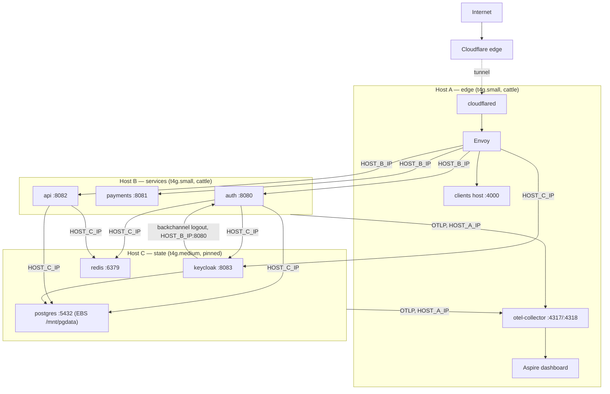

# State host split — Host C for Postgres, Redis, Keycloak

*Plan to move the stateful tier off Host B onto a third EC2 instance. After this,
Host B runs only the three gRPC services and becomes disposable; Host C owns the
pgdata volume and everything that touches it.*

## 1. Goal

| Today                                                   | After                                                  |
| ------------------------------------------------------- | ------------------------------------------------------ |
| Host A — edge (cloudflared, Envoy, clients, otel, dashboard) | unchanged                                         |
| Host B — auth, payments, api **+ Keycloak, Postgres, Redis** on the pgdata volume | Host B — auth, payments, api only. Pure cattle. |
| —                                                       | **Host C — Keycloak, Postgres, Redis** on the pgdata volume. Pinned, drained on shutdown. |

Why: today a service rebuild, an AMI refresh, or a resize of Host B all put the
database at risk, so Host B carries the "never replace by accident" posture that
only the state tier needs. Splitting lets Host B be treated like Host A (floating
AMI, replace on boot-config change) and confines the careful handling to one box.

## 2. Target topology

### Cross-host edges

Every edge is a private IP plus a published port, admitted by the self-referencing
security group. New rows are marked.

| From → To      | Port(s)     | Purpose                                   | New |
| -------------- | ----------- | ----------------------------------------- | --- |
| A → B          | 8080–8082   | Envoy → auth / payments / api             |     |
| A → C          | 8083        | Envoy → Keycloak vhost                    | ✱ (was A → B) |
| B → C          | 5432        | auth, api, both migration jobs → Postgres | ✱   |
| B → C          | 6379        | auth, api → Redis                         | ✱   |
| B → C          | 8083        | auth → Keycloak back-channel              | ✱ (was same-host) |
| C → B          | 8080        | Keycloak → auth `/backchannel-logout`     | ✱ (was same-host) |
| B → A, C → A   | 4317        | OTLP export (services, Keycloak)          |     |

### What each host's `.env` carries

Every host gets **all three** private IPs (`HOST_A_IP`, `HOST_B_IP`, `HOST_C_IP`),
including its own. That removes the "which peer does this host need" bookkeeping
from cloud-init and the deploy job, and lets a host bind its published ports to its
own private address.

| Host | `HOST_ROLE` | Uses                                            |
| ---- | ----------- | ----------------------------------------------- |
| A    | `edge`      | `HOST_B_IP` (services), `HOST_C_IP` (Keycloak)  |
| B    | `services`  | `HOST_A_IP` (OTLP), `HOST_C_IP` (Postgres, Redis, Keycloak) |
| C    | `state`     | `HOST_A_IP` (OTLP), `HOST_B_IP` (backchannel logout), `HOST_C_IP` (own bind address) |

## 3. Decisions

**D1 — Naming.** The new role is `state`: `Role=state` tag, `Name=protofast-state`,
`HOST_ROLE=state`, `docker-compose.host-state.yml`, `user_data.host_state.sh.tftpl`,
`HOST_C_IP`. Host B keeps `services`; only its contents shrink.

**D2 — Host B becomes cattle, Host C inherits the stateful posture.** The
`ignore_changes = [ami]`, `user_data_replace_on_change = false`, the systemd drain
unit, the fstab mount, and the backup timer all move from B to C verbatim. B gets
the edge posture: floating AMI, replaced on any user_data change, no lifecycle unit.

**D3 — The pgdata volume moves, it is not copied.** `aws_volume_attachment.pgdata`
points at `host_c`. The volume resource itself is untouched (`prevent_destroy`
stays). Terraform replaces the attachment: stop old B (which triggers the systemd
drain), detach, attach to C. No dump/restore, no data copy, no new volume.

**D4 — Published ports bind to the private IP.** Host C publishes
`${HOST_C_IP}:5432:5432`, `${HOST_C_IP}:6379:6379`, `${HOST_C_IP}:8083:8080` rather
than `0.0.0.0`. The security group already blocks the public interfaces; binding
narrowly means a misconfigured SG still does not expose the database on the public
IPv4/IPv6 address. (Host B's 8080–8082 can get the same treatment later; not required.)

**D5 — Redis gets a password.** Today Redis is reachable only over Host B's compose
network. Once published across hosts it should not rely on the SG alone. Add
`Infra_RedisPassword` to `protofast/app` (generated by `populate-secrets.sh --prod`
like the DB passwords), seed a root-only `redis.conf` on C
(`requirepass`, `maxmemory`, `maxmemory-policy`) and pass
`password=` in the StackExchange.Redis connection string on B. No service code
changes: `AddRedisClient` already takes a full connection string. This is the one
item that can be split into a follow-up PR if the cutover needs to be smaller.

**D6 — Role and database convergence belongs to Host C.** `ensure_auth_db` and
`ensure_protofast_db` run `compose exec postgres`, which only exists on C. They run
on the postgres apply and on C's bootstrap, as today. The migration runners on B
no longer call them; a missing role fails the migration (28P01) fail-closed with a
log line pointing at `deploy-postgres`. Consequence: `Api_DbPassword` must be in the
secret before the first api deploy, which is already the documented rule.

**D7 — One manifest per role.** `push_manifest` currently writes every host's
`versions.env` to the single key `deploy/versions.env`, so the last host to deploy
overwrites the others and a rebuilt box may bootstrap from a sibling's manifest.
With three hosts this gets worse. Change the key to `deploy/versions.<role>.env`;
cloud-init pulls its own. Side benefit for the cutover: the new templates ignore
the old key, so freshly built B and C come up idle until their first deploy.

**D8 — Sizing.** C takes over the JVM and Postgres, so C = `t4g.medium` (the old B
default) and B drops to `t4g.small` for three chiseled .NET services. Net cost is one
extra `t4g.small`. Both are variables; override in tfvars if B turns out tight.

**D9 — All three roles share the instance profile.** Splitting IAM per host is a
follow-up. B still needs Secrets Manager (auth reads it in-process); C needs it for
`deploy.sh` and the backup timer.

## 4. Changes by area

### 4.1 Terraform (`infra/`)

- `variables.tf` — add `host_c_instance_type` (default `t4g.medium`) and
  `host_c_ip_offset` (default `12`, must differ from 10/11). Change
  `host_b_instance_type` default to `t4g.small` and its description.
- `compute.tf`
  - `local.host_c_private_ip = cidrhost(subnet, var.host_c_ip_offset)`.
  - Every `templatefile` call receives `host_a_ip`, `host_b_ip`, `host_c_ip`.
  - `aws_instance.host_b`: `user_data_replace_on_change = true`, drop the
    `lifecycle { ignore_changes = [ami] }`, keep `http_put_response_hop_limit = 2`
    (auth reads Secrets Manager from inside a container). Update the header comment.
  - New `aws_instance.host_c`: copy of today's `host_b` block with
    `Role = "state"`, `Name = "${var.project}-state"`, `user_data = local.user_data_state`,
    `user_data_replace_on_change = false`, `ignore_changes = [ami]`. Hop limit can be
    `1`: nothing on C calls AWS from inside a container.
- `ebs.tf` — `aws_volume_attachment.pgdata.instance_id = aws_instance.host_c.id`.
  Keep `stop_instance_before_detaching`. Update the comments that say "Host B".
- `network.tf` — two new self-only ingress rules: `5432` and `6379`. Reword the
  8080–8083 and 4317–4318 descriptions (they now also cover C).
- `iam.tf` — `ManifestPut` resource becomes `deploy/versions.*.env` (D7). Nothing
  else changes.
- `outputs.tf` — add `host_c_instance_id`, `host_c_private_ip`; `role_tags` gains
  `host_c = "Role=state"`.
- `terraform.tfvars.example`, `infra/README.md` — mention the new variables; the
  first-pass order becomes: state tier on C, then services on B, then the edge.

### 4.2 cloud-init templates (`infra/templates/`)

- `user_data.host_state.sh.tftpl` (new) — today's `host_services` template minus
  the .NET concerns: SSM agent, common fragment, mount `/dev/sdf` at `/mnt/pgdata`,
  fetch the app secret and write `kc-db-password` / `auth-db-password` /
  `redis.conf`, seed `.env` with `HOST_ROLE=state`, all three IPs, region, ECR,
  assets bucket, Keycloak domain. Install the `protofast-hostc.service` drain unit
  and the `protofast-pgbackup.timer`. Bootstrap pulls
  `deploy/versions.state.env`, `deploy/docker-compose.host-state.yml`, `deploy.sh`,
  `backup.sh`, and syncs `deploy/keycloak/`.
- `user_data.host_services.sh.tftpl` (rewritten) — the edge template's shape:
  SSM agent, common fragment, seed `.env` (`HOST_ROLE=services`, three IPs, region,
  ECR, assets bucket, Keycloak domain), pull `deploy/versions.services.env` +
  `docker-compose.host-services.yml` + `deploy.sh`, run `deploy.sh bootstrap`. No
  volume, no lifecycle unit, no secret files (deploy.sh seeds `.env` values).
- `user_data.host_edge.sh.tftpl` — seed `HOST_C_IP` next to `HOST_B_IP`; pull
  `deploy/versions.edge.env`.

### 4.3 Compose (`deploy/`)

- `docker-compose.host-state.yml` (new) — `postgres`, `keycloak`, `redis` lifted
  from the services file, with:
  - ports bound to `${HOST_C_IP}` (D4): `5432`, `6379`, `8083→8080`;
  - Keycloak `BACKCHANNEL_LOGOUT_URL: http://${HOST_B_IP}:8080/backchannel-logout`;
  - OTLP endpoints still `http://${HOST_A_IP}:4317`;
  - Redis: `command: redis-server /usr/local/etc/redis/redis.conf` with the conf
    mounted from `/opt/protofast/redis.conf` (D5), instead of inline flags;
  - `secrets:` block keeps `kc-db-password`, `auth-db-password`; drops `internal-jwt-pub`.
- `docker-compose.host-services.yml` — remove the three stateful services and every
  `depends_on` that pointed at them (a service that starts before Postgres answers
  just retries; the migration jobs fail closed). Rewire:
  - `ConnectionStrings__auth` / `__protofast`: `Host=${HOST_C_IP};Port=5432;…`
  - `ConnectionStrings__redis`: `${HOST_C_IP}:6379,password=${REDIS_PASSWORD}`
  - `Auth_Keycloak__Authority`: `http://${HOST_C_IP}:8083`;
    `ConnectionStrings__keycloak`: `http://${HOST_C_IP}:8083/realms/protofast`.
    Issuer is unaffected because `KC_HOSTNAME` is a full URL (see the existing
    comment on the keycloak service).
  - `secrets:` block keeps only `internal-jwt-pub`.
- `deploy/postgres/backup.sh` — unchanged (it runs on whichever host has the
  postgres container; comments say "Host B" → "Host C").

### 4.4 `deploy/deploy.sh`

- `HOST_ROLE` gains `state`. Every `case` on it grows a branch:
  - `host_bringup_sets`: `state` → `ALWAYS_UP="postgres redis keycloak"`, no tagged
    services; `services` → `SERVICE_TAGS="auth payments api"`, `ALWAYS_UP=""`.
  - Peer-IP gate: `edge` needs B+C, `services` needs A+C, `state` needs A+B+C.
- Persist `HOST_C_IP` alongside `HOST_A_IP` / `HOST_B_IP` when passed.
- `ensure_secret_files` splits by what the shipped compose file references (same
  fail-closed reasoning as the existing `grep kc-db-password` gate):
  - compose mentions `kc-db-password` → **state** seeding: the two password files,
    `redis.conf` (D5), the Keycloak client secrets, SMTP, Google/Apple; then
    `write_*_initdb` and `sync_keycloak_config`.
  - compose mentions `internal-jwt-pub` → **services** seeding: `internal-jwt-pub`,
    `AUTH_DB_PASSWORD` (new: cloud-init no longer writes it), `PROTOFAST_DB_PASSWORD`,
    `REDIS_PASSWORD`, client secrets, SMTP, `INTERNAL_JWT_KEY_ID`.
- `run_auth_migrations` / `run_api_migrations`: drop the `ensure_*_db` calls (D6);
  on failure log "role missing? run deploy-postgres first".
- `apply_kind stateful` (postgres branch) still calls both `ensure_*_db` — that is
  now the only place besides bootstrap.
- `drain`: message says Host C; the container list is `keycloak postgres` (no
  services on this box any more).
- `redis_ok`: authenticate (`REDISCLI_AUTH` from `.env`) once D5 lands.
- `push_manifest`: key `deploy/versions.${HOST_ROLE}.env` (D7).
- Header comments: three-host contract, `state` in the usage line.

### 4.5 Workflows (`.github/workflows/`)

- `_component-deploy.yml`
  - `host` input stays `edge | services` (nothing built lands on C).
  - "Resolve peer host IP" → "Resolve host IPs": one `describe-instances` call,
    map `Role` tag → IP for all running instances, export `HOST_A_IP`, `HOST_B_IP`,
    `HOST_C_IP`; fail if any of the three is missing. Pass all three to
    `deploy.sh`.
  - "Publish deploy artifacts": drop the `backup.sh` copy from the `services` branch.
- `deploy-postgres.yml`, `deploy-redis.yml`, `deploy-keycloak.yml`
  - target filter `Name=tag:Role,Values=state`;
  - ship and publish `deploy/docker-compose.host-state.yml` (S3 object name too);
  - `push.paths` → the state compose instead of the services one;
  - add the same "Resolve host IPs" step and pass the three IPs (today these
    workflows pass none and rely on cloud-init's seed).
  - Optional tidy-up while touching all three: extract the shared SSM block into
    a `_stateful-deploy.yml` reusable workflow. Not required for the split.
- `infra.yml` — no change.

### 4.6 Scripts and docs

- `scripts/populate-secrets.sh --prod` — generate `Infra_RedisPassword` when
  missing (D5), same character rules as the DB passwords.
- `docs/01-topology.md` — production diagram and "key facts" (three hosts, only C
  holds state, B is cattle).
- `docs/07-deployment.md` — component table gets host `C` for the pinned tiers;
  "what the box holds" lists per-role manifests and `redis.conf`.
- `docs/08-infrastructure.md` — compute table becomes three columns; knobs table
  adds `host_c_instance_type`; safety rails now name Host C.
- `docs/09-reference.md` — ports table (5432/6379 now published on C, 8083 on C),
  `.env` keys (`HOST_C_IP`, `REDIS_PASSWORD`).
- `infra/README.md` — secrets table adds `Infra_RedisPassword`; section 3
  first-pass order.
- Comment sweep: every "Host B" that means the stateful tier → "Host C"
  (`compute.tf`, `ebs.tf`, `iam.tf`, both compose files, `deploy.sh`, `backup.sh`).

## 5. Cutover runbook

Expect the services tier to be down from step 3 until step 5 completes, roughly
the length of one Terraform apply plus three stateful deploys. Do it in a window.

1. **Before merging**, as OrgAdmin: `scripts/populate-secrets.sh --prod` so
   `Infra_RedisPassword` exists. Take a manual backup over SSM on the current
   Host B: `/opt/protofast/backup.sh`. Confirm the objects landed under
   `backups/postgres/`.
2. **Merge the PR.** The path-triggered deploy workflows will fire against the old
   topology and fail fast: the stateful ones find no `Role=state` instance, the
   service ones hit the `HOST_C_IP` gate before touching a container. That is the
   expected noise; a `[skip ci]` in the merge commit avoids it.
3. **Drain old Host B** over SSM: `systemctl stop protofast-pgbackup.timer` then
   `/opt/protofast/deploy.sh drain`. Postgres shuts down cleanly and the volume
   unmounts. (Terraform's stop-before-detach would trigger the same drain via
   systemd; doing it by hand first makes step 4 boring.)
4. **`infra.yml` → apply.** Review the plan first: it must show
   `aws_volume_attachment.pgdata` replaced, `aws_instance.host_b` replaced,
   `aws_instance.host_c` created, two SG rules added, and **no** change to
   `aws_ebs_volume.pgdata`. If the volume shows anything but "no changes", stop.
   Both new boxes come up idle: their per-role manifest keys do not exist yet.
5. **Bring up C, then B, then re-point A**, by dispatching in this order and
   waiting for each to go green:
   1. `deploy-postgres` — mounts the existing cluster, converges the `auth` and
      `protofast` roles from the secret, publishes the state compose and
      `backup.sh`, writes `versions.state.env`.
   2. `deploy-keycloak` — syncs realm/themes/providers, imports nothing new
      (realm already on the volume), reconciles.
   3. `deploy-redis`.
   4. `deploy-auth`, `deploy-payments`, `deploy-api` (parallel is fine).
   5. `deploy-envoy` — the compose's `KEYCLOAK_HOST` now interpolates `HOST_C_IP`,
      so the drift check recreates Envoy with the new upstream.
6. **Verify** (section 7).

## 6. Rollback

Data is never at risk: Postgres only ever runs from the attached volume, and it is
drained before every detach. Rolling back is the same move in reverse:

1. Revert the merge commit on `main`.
2. Drain C over SSM (`deploy.sh drain`).
3. `infra.yml` → apply: attachment moves back to B, B is replaced again (its
   user_data changed back), C is destroyed. The plan must again show no change to
   `aws_ebs_volume.pgdata`.
4. Dispatch `deploy-postgres`, `deploy-keycloak`, `deploy-redis`, the three
   services, then `deploy-envoy`. The old workflows still publish to the single
   `deploy/versions.env` key, which the reverted templates read.

## 7. Verification checklist

- `terraform output` shows three instance ids and three private IPs.
- On C: `mount | grep pgdata`, `systemctl status protofast-hostc protofast-pgbackup.timer`,
  `docker ps` shows exactly postgres, keycloak, redis; `ss -ltn` shows 5432, 6379,
  8083 bound to the private IP only.
- On B: `docker ps` shows exactly auth, payments, api; `/opt/protofast/.env` has
  all three `HOST_*_IP` lines and no `kc-db-password` file exists.
- Sign in on `protofast.dev` (exercises A→C Keycloak vhost, B→C back-channel and
  Redis, B→C Postgres), then sign out (C→B backchannel logout: check auth's log
  for the logout token).
- A gRPC call through the api that hits the rate limiter (B→C Redis) and a document
  list (B→C Postgres).
- Aspire dashboard shows traces from auth, api, and Keycloak (B→A, C→A OTLP).
- Run `backup.sh` by hand on C; objects appear under `backups/postgres/`.
- S3 `deploy/` holds `versions.edge.env`, `versions.services.env`, `versions.state.env`
  and `docker-compose.host-state.yml`.
- Replace test for the new cattle posture: `terraform apply -replace=aws_instance.host_b`
  brings B back from `versions.services.env` with no manual step.

## 8. Risks and gotchas

- **The attachment replacement stops old Host B.** `stop_instance_before_detaching`
  stops the instance, and Terraform then destroys it (it is being replaced anyway).
  If for any reason `host_b` is *not* planned for replacement, the apply leaves the
  old box stopped rather than restarting it. The plan review in step 5.4 is what
  catches this.
- **First-boot ordering.** C's cloud-init reads the app secret at boot; if the
  secret is unreadable the boot aborts after the SSM agent is up, and the next
  `deploy-postgres` re-seeds everything (existing `ensure_secret_files` rationale).
  Same for B.
- **Compose `depends_on` removal.** auth starts before Postgres answers on a full
  bring-up; Npgsql and StackExchange.Redis retry, the gRPC health probe gates the
  deploy. Bootstrap on B may log connection errors for a few seconds after a
  simultaneous C rebuild. Expected.
- **Redis password rotation** needs both a C redis apply (new `redis.conf`) and a
  B auth/api apply (new connection string); until both land, auth's session store
  fails. Rotate in a window.
- **Two hosts now export to A's collector**, still bound to `0.0.0.0` on A. Fine
  under the SG; noted only because the state box is a new sender.
- **SSM parameter cap.** `deploy.sh` grows by the role branches; it is gzipped
  before base64 and sits around 35 KB of the 97 KB budget today. Re-check the size
  in the first workflow run.

## 9. Out of scope, worth doing after

- Per-role instance profiles (B: Secrets Manager + ECR + documents bucket; C:
  Secrets Manager + backups prefix; A: assets + ECR).
- Bind Host B's 8080–8082 and Host A's 4317–4318 to their private IPs (D4 for the
  other two hosts).
- TLS between B and C (Postgres `sslmode=require` with a self-signed server cert
  on C, Redis TLS). Traffic is intra-subnet and SG-scoped today.
- Extract the three stateful workflows' shared SSM block into one reusable workflow.
