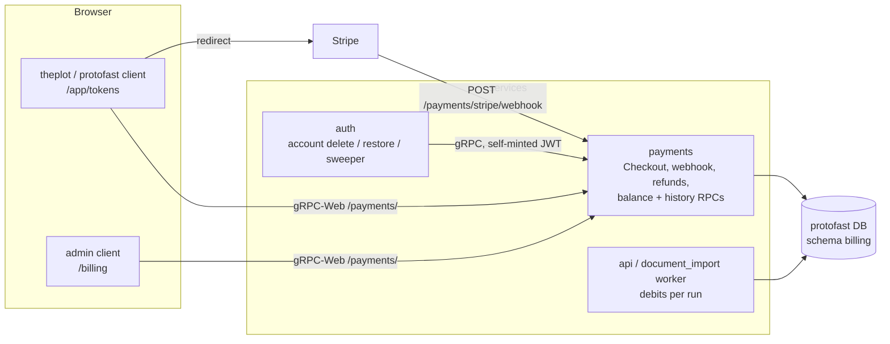

# Stripe token billing — purchases, ledger, refunds, soft delete

*Plan for letting users buy tokens through Stripe, spending them on LLM generation,
recording every movement in a ledger, refunding them when an app is de-listed, and
holding accounts with a meaningful balance for 30 days before deletion. Ships to
production on Stripe **test mode** first; the live switch is a config change.*

## 1. Goal

| Capability | Summary |
|---|---|
| Buy tokens | Stripe Checkout (hosted page), fixed packs, credited by webhook. No card data ever touches ProtoFast. |
| Spend tokens | Generation debits the wallet atomically with the run; a run that cannot be paid for is refused. |
| Ledger | Every credit and debit is an append-only entry with an idempotency key; the balance is derivable from it. |
| Add / reduce | Admin adjustments (with a note) on top of purchases, usage, refunds and forfeits. |
| Refund | Admin refunds a user's unspent purchased tokens to the original payment. "De-list app" refunds every wallet in a tenant. |
| Soft delete | Deleting an account whose wallet is worth more than $10 holds it for 30 days; signing in restores it. Below that, deletion stays immediate. |
| Warnings | The delete dialog states what will be lost and, for a held account, how long there is to change their mind. |
| Test → live | Prod runs on `sk_test_` keys until purchases work end to end; then the live keys and price ids replace them and test balances are cleared. |

## 2. Where things live

**One ledger, one library, two writers.** The wallet lives in the existing
`protofast` database as a new `billing` schema, implemented in a new project
`services/payments/src/ProtoFast.Payments.Data` (entities, `BillingDbContext`,
`IWalletLedger`). Both `payments` and `api` reference it:

- `payments` credits (Stripe), refunds, forfeits, adjusts, and serves balance/history.
- `api`'s worker debits. It runs in the same database as the workflow engine's
  `engine` schema, so a debit commits in the same transaction as the run it pays
  for. This is why the ledger is not behind a gRPC call: the worker has no user
  JWT to present when a run finishes minutes later, and a debit that can fail
  separately from the run would leak tokens.

Consequences: `payments` gains `ConnectionStrings__protofast` (Aspire reference in
dev, compose env in prod); the `billing` schema is added to the existing
`ProtoFast.SchemaMigrations` runner (`api-migrations`), so there is no new
migrations job; `deploy.sh`'s build context for `api` gains `services/payments`.

`auth` never touches the schema. It asks `payments` over gRPC, signing the call
with an internal JWT it mints for the subject in question — auth is the one
service holding the private key.

## 3. Data model (`billing` schema)

Every entity is user-scoped through the shared `UserId` convention; system writers
(webhook, worker, admin, sweeper) set `UserContext.SetCurrentUser` explicitly for
the wallet they are acting on. All rows also carry `Tenant` (the realm from the
JWT's `tenant` claim) because tokens are bought inside one app and "de-list an
app" is a tenant-wide operation.

| Entity | Key columns | Notes |
|---|---|---|
| `Wallet` | `Tenant`, `UserId`, `Balance` | Cached balance; `CHECK (Balance >= 0)`. Debits are `UPDATE … SET Balance = Balance - @n WHERE Balance >= @n`, so concurrency is settled by the row lock, not by application code. |
| `LedgerEntry` | `Id`, `Tenant`, `UserId`, `Kind`, `Tokens` (signed), `BalanceAfter`, `Reference`, `Note`, `ActorUserId`, `IdempotencyKey` (unique), `CreatedAt` | Append-only. `Kind` ∈ `Purchase`, `Usage`, `Refund`, `Adjustment`, `Forfeit`, `Reversal`. `Reference` is the purchase id, run id or refund id. `ActorUserId` records the admin for adjustments and refunds. |
| `Purchase` | `Id`, `Tenant`, `UserId`, `PriceId`, `Tokens`, `AmountCents`, `Currency`, `Livemode`, `Status`, `StripeCheckoutSessionId`, `StripePaymentIntentId`, `RefundedTokens`, `RefundedCents`, `CreatedAt`, `PaidAt` | `Status` ∈ `Pending`, `Paid`, `Failed`, `Expired`. `Livemode` comes from the Stripe event and is what separates test-mode purchases from real ones at cutover. |
| `Refund` | `Id`, `PurchaseId`, `Tokens`, `AmountCents`, `Reason`, `Status`, `StripeRefundId`, `RequestedBy`, `CreatedAt`, `SettledAt` | `Reason` ∈ `AppDelisted`, `Admin`. `Status` ∈ `Pending`, `Succeeded`, `Failed`. |
| `StripeEvent` | `EventId` (PK), `Type`, `Livemode`, `ReceivedAt`, `ProcessedAt` | Webhook idempotency. Stripe retries; the second delivery is a no-op. |
| `TenantBilling` | `Tenant`, `SalesOpen`, `DelistedAt` | `SalesOpen=false` refuses new checkouts; set by "de-list app". |

`auth` schema: `UserAccount` gains `DeletedAt` (`DateTimeOffset?`). Nothing else
changes there.

### Units and valuation

- **Tokens are integers.** `Billing:CentsPerToken` (default `1`) is the list rate:
  packs are sold at it, and the worker converts a run's `Cost.Amount` (USD) to
  tokens at `Billing:UsageMultiplier` × that rate, rounded up.
- **Cash value of a wallet** = what Stripe would give back for it: walk `Paid`
  purchases newest-first, take `min(remaining balance, Tokens − RefundedTokens)`
  from each, price it at that purchase's `AmountCents / Tokens`. One function,
  `WalletValuation.Refundable(wallet)`, serves both the refund calculation and the
  $10 soft-delete threshold, so the two can never disagree. Adjustment tokens
  (never paid for) fall outside it and are not refundable.

## 4. Flows

### 4.1 Buy tokens

1. Client calls `Billing.CreateCheckoutSession(priceId)`. `payments` checks
   `TenantBilling.SalesOpen`, that `priceId` is in `Billing:Packs`, inserts a
   `Pending` purchase, and creates a Stripe Checkout Session (`mode=payment`,
   `client_reference_id=purchaseId`, metadata `tenant`/`userId`/`tokens`,
   `customer_email` from the JWT). Returns the session URL; the client redirects.
2. Success URL `/app/tokens?checkout=success&purchase=<id>`; cancel URL
   `/app/tokens?checkout=cancelled`. On return the page polls `GetBalance` for up
   to 20 s while showing "confirming" — the same pattern the existing subscribe
   page uses, because the webhook can land after the redirect.
3. Webhook `checkout.session.completed` (and `async_payment_succeeded`): verify the
   signature, record `StripeEvent`, mark the purchase `Paid`, credit the wallet
   with a `Purchase` ledger entry whose idempotency key is the event id, all in one
   transaction. `async_payment_failed` / `checkout.session.expired` mark it
   `Failed` / `Expired`.
4. `charge.refunded` reconciles a refund made from the Stripe dashboard: if no
   matching `Refund` row exists, debit the tokens (floored at zero) and create one
   with `Reason=Admin`. `charge.dispute.created` debits the disputed purchase's
   unspent tokens and logs a warning for manual follow-up.

### 4.2 Spend tokens

The worker debits in two steps inside the run's own transactions:

1. **Hold** when the run is admitted: debit the stage budget converted to tokens
   (`Usage` entry, key `run:<id>:hold`). If the wallet cannot cover it the run is
   refused with `InsufficientTokens`, which the client turns into a "buy tokens"
   prompt with the shortfall.
2. **Settle** when the run finishes: compute actual cost, then either debit the
   difference or credit the unused part back (`Reversal` entry, key
   `run:<id>:settle`). A run that fails or is cancelled credits the whole hold
   back. Both keys are unique, so a retried settle cannot double-charge.

### 4.3 Adjust (admin)

`AdminBilling.Adjust(tenant, userId, tokens, note)`: signed `Adjustment` entry
with `ActorUserId`. A negative adjustment cannot take the balance below zero. The
note is mandatory and is what the user sees in their history.

### 4.4 Refund

`AdminBilling.Refund(tenant, userId, tokens?, reason)` — `tokens` defaults to
the whole balance:

1. Compute the LIFO plan from §3 (which purchases, how many tokens, how many cents
   each).
2. For each step, in one transaction: insert `Refund(Pending)`, write the `Refund`
   ledger entry, bump `Purchase.RefundedTokens/Cents`.
3. Call `stripe.refunds.create(payment_intent, amount)`. On success mark
   `Succeeded` and store `StripeRefundId`. On failure write a `Reversal` entry
   that puts the tokens back, mark `Failed`, and surface the Stripe error.

Stripe declines refunds on charges older than its window (about 180 days) and on
disputed charges; those steps fail cleanly and are listed for manual handling.

**De-list app**: `AdminBilling.DelistTenant(tenant)` sets `SalesOpen=false` and
`DelistedAt`, then runs `Refund` for every wallet in the tenant with a positive
balance, `Reason=AppDelisted`. It is resumable — it skips wallets that already
have a `Succeeded` refund after `DelistedAt` — and reports per-user outcomes. A
dry-run variant returns the plan and total cents without touching anything.

### 4.5 Delete, hold, restore

Today `POST /account/delete` removes the Keycloak user, then the local row and the
sessions. It becomes:

1. Ask `payments` for `WalletValuation.Refundable` (gRPC, self-minted JWT).
2. **Value ≤ $10**: as today, plus `payments.Forfeit(tenant, userId)` first, which
   zeroes the wallet with a `Forfeit` entry. Tokens are gone with the account.
3. **Value > $10**: stamp `UserAccount.DeletedAt = now`, drop the BFF sessions, and
   stop. The Keycloak user is kept, and so is the subject, which is what makes
   restore possible without losing ownership of anything.

While `DeletedAt` is set:

- ext_authz `Check` finds no session, so every protected request is anonymous.
- The sign-in callback, after `ProvisionAsync`, sees `DeletedAt` and does not issue
  a session. Instead it redirects to `/restore`, an auth-served page that says when
  the account will be deleted for good and offers **Restore my account** (`POST
  /account/restore`: clears `DeletedAt`, then continues the normal callback) or
  **Sign out**.
- If `DeletedAt` is more than 30 days old the callback treats the account as gone
  and shows the "deleted" page; the sweeper finishes the job.

**Sweeper**: a hosted service in `auth` runs daily and, for each row with
`DeletedAt < now − Account:HoldDays`, performs the hard delete: `payments.Forfeit`,
Keycloak user, local row, in that order. Each step is logged and retried on the
next run, so a Keycloak outage delays but never skips a deletion.

**Warnings** in the account page's delete dialog, driven by `GET /account`, which
now returns `wallet: { tokens, refundableCents, holdDays }`:

- Balance zero: unchanged.
- Value ≤ $10: "You have *N* tokens (about $*X*). They are lost the moment your
  account is deleted and cannot be refunded."
- Value > $10: "You have *N* tokens (about $*X*). Your account is closed now and
  permanently deleted in 30 days. Sign in before then to restore it and your
  tokens; after that they are lost."

The confirmation still requires typing the email address.

## 5. Interfaces

### gRPC (payments), all behind the internal JWT

| Service | RPC | Caller | Authorization |
|---|---|---|---|
| `Billing` | `GetBalance`, `ListTransactions(page)`, `ListPacks`, `CreateCheckoutSession(priceId)` | app clients (gRPC-Web) | the JWT subject's own wallet |
| `AdminBilling` | `FindWallet(tenant, email)`, `Adjust`, `Refund`, `DelistTenant(dryRun)`, `ListRefunds(tenant)` | admin client | JWT `roles` contains `admin` |
| `WalletInternal` | `Valuation(tenant, userId)`, `Forfeit(tenant, userId)` | `auth` | JWT `roles` contains `service:auth`, which only auth's own minting path emits |

`ListPacks` returns each pack's tokens, display price and a `testMode` flag so
the client can show a "Test mode — no real charges" banner.

### HTTP (payments)

`POST /stripe/webhook` — Stripe signature verified with `Stripe:WebhookSecret`,
5-minute tolerance, raw body read before model binding. Returns 200 on duplicate
events and 400 on bad signatures. Registered on the same Kestrel h2c endpoint;
Envoy translates the inbound HTTP/1.1 request.

### Auth endpoints

`POST /account/delete` (changed as in §4.5), `POST /account/restore` (new),
`GET /account` (adds the `wallet` block), `GET /restore` (new page).

## 6. Edge, config and secrets

**Envoy** (`proxy/envoy.vhost.yaml.tmpl`): one new route ahead of the `/payments/`
prefix — `path: "/payments/stripe/webhook"` → cluster `payments`,
`prefix_rewrite: "/stripe/webhook"`, ext_authz disabled. Exact `path`, not
another regex: the vhost regex program budget is already near its limit.

**Config** (env names identical in dev and prod, per the naming convention):

| Key | Where | Purpose |
|---|---|---|
| `Payments_Stripe__SecretKey` | Secrets Manager | `sk_test_…` first, `sk_live_…` after cutover |
| `Payments_Stripe__WebhookSecret` | Secrets Manager | `whsec_…` for the endpoint registered in that mode |
| `Payments_Billing__Packs__n__PriceId` / `__Tokens` / `__DisplayUsd` | env | packs offered; price ids differ between test and live |
| `Payments_Billing__CentsPerToken` | env | list rate, default 1 |
| `Payments_ConnectionStrings__protofast` | Aspire / compose | the shared database |
| `Api_Billing__UsageMultiplier` | env | markup applied when converting run cost to tokens |
| `Auth_Account__HoldDays` | env | default 30 |
| `Auth_Account__SoftDeleteThresholdCents` | env | default 1000 |

`Payments_StripeKey` already listed in `docs/06-secrets.md` is renamed to the
sectioned key above so it binds to `StripeOptions`.

**Dev**: `stripe listen --forward-to https://localhost:<envoy-port>/payments/stripe/webhook`
from the Stripe CLI; its printed `whsec_` goes into `protofast/dev`.

## 7. Clients

**App client** (`theplot` first — it runs generation; `protofast`'s `subscribe`
page is left as is until that site sells anything):

- `/app/tokens`: balance, packs (buy buttons → checkout redirect), transaction
  history (kind, tokens, balance after, note, date), the test-mode banner, and the
  post-checkout "confirming" state.
- Insufficient-tokens errors from generation link to `/app/tokens` with the
  shortfall shown.
- Account page: the delete warning from §4.5.

**Admin client**: `/billing` — find a wallet by tenant + email; balance, history,
purchases and refunds; **Adjust** (tokens + note) and **Refund** (tokens, default
all) with confirmation; `/billing/tenants` — per-tenant totals, **Close sales**,
**De-list and refund** with dry-run preview, and the outcome list.

## 8. Test mode in production, then live

1. Register a **test-mode** webhook endpoint at
   `https://<app host>/payments/stripe/webhook` in the Stripe dashboard; populate
   `protofast/app` with the test secret key, that endpoint's signing secret and the
   test price ids. Deploy.
2. Buy with card `4242 4242 4242 4242`, spend on a real generation, refund from the
   admin console, delete an account above and below the threshold, restore one.
   Watch the `StripeEvent` table and traces.
3. **Cutover**, in one deploy: register the live webhook endpoint; write the live
   secret key, its signing secret and live price ids with
   `scripts/populate-secrets.sh --prod`; restart `payments`.
4. Immediately after: run `AdminBilling.ClearTestBalances`, which forfeits every
   wallet whose entire credit history is `Livemode=false` and writes a `Forfeit`
   entry with note `test-mode cutover`. Test purchases stay in the table for the
   record, flagged by `Livemode`.
5. Guard: on startup `payments` logs the key mode, and the webhook rejects events
   whose `livemode` does not match the key, so a stale test endpoint cannot credit
   real wallets.

## 9. Delivery order

Each step is deployable on its own and leaves the previous behaviour intact.

| # | Step | Touches |
|---|---|---|
| 1 | `ProtoFast.Payments.Data`: entities, `BillingDbContext`, `IWalletLedger`, migration in the `api-migrations` runner; unit tests for the ledger invariants (idempotency, no negative balance, valuation) | payments, api |
| 2 | `payments`: `Billing` RPCs, Stripe Checkout, webhook, Envoy route, secrets, `StripeOptions` startup check | payments, proxy, apphost, deploy |
| 3 | App client `/app/tokens` and the confirming flow | theplot |
| 4 | Worker hold/settle on runs; `InsufficientTokens` in the client | api, document_import, theplot |
| 5 | `AdminBilling`: find, adjust, refund, de-list; admin `/billing` pages | payments, admin |
| 6 | Soft delete: `DeletedAt`, `WalletInternal`, changed delete endpoint, restore page, sweeper, account warnings | auth, payments, theplot, protofast |
| 7 | Prod on test keys, checklist in §8, cutover | deploy, secrets |

## 10. Decisions and open points

- **Hosted Checkout, not Elements.** Keeps card data off ProtoFast entirely and
  needs no publishable key in the clients.
- **No Stripe Customer table yet.** Checkout creates a customer per session;
  refunds only need the payment intent. Add one when saved cards or receipts
  history become a requirement.
- **Bonus or adjusted tokens are never refunded** — only tokens someone paid for,
  at the price they paid.
- **Forfeited tokens are not refunded on delete.** A user who wants money back
  asks before deleting; the warning says so.
- **Currency** is a single configured currency per pack (USD to start). Stripe
  handles tax if Stripe Tax is later enabled on the Checkout Session.
- **Open**: whether `protofast`'s own site sells tokens or only tenant apps do;
  the plan assumes tenant apps and builds the UI in `theplot` first.
