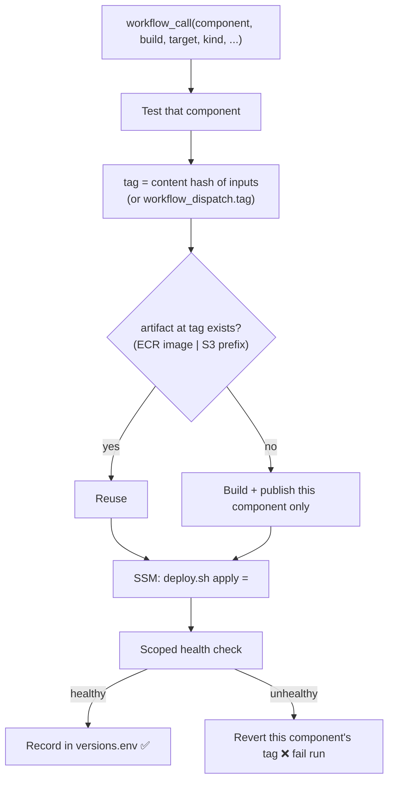
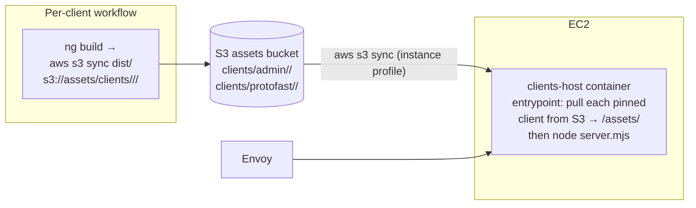

# ProtoFast Independent Deployment — Architecture

`Replace deploy.yml` with separate deployment pipelines.

**The unified SSR host is kept.** Both client apps are served by a single Node
process routed by the `x-client` header
([clients/host/server.mjs](../clients/host/server.mjs)), behind Envoy's single
catch-all `clients_host` cluster. Independence for the clients comes from
**publishing each client's built assets to S3 and having the host pull every
client's pinned assets at deploy time** (§7), not from splitting the host.

---

## 1. Components

Each row is an independent deploy unit with its own workflow, its own artifact,
its own version tag, and its own line in the on-instance version manifest.


| Component          | Workflow                                        | Artifact                          | Build                                | Trigger paths                                  |
| ------------------ | ----------------------------------------------- | --------------------------------- | ------------------------------------ | ---------------------------------------------- |
| `auth`             | `.github/workflows/deploy-auth.yml`             | ECR `protofast-auth`              | `dotnet publish /t:PublishContainer` | `services/auth/`**, `services/shared/**`       |
| `payments`         | `.github/workflows/deploy-payments.yml`         | ECR `protofast-payments`          | `dotnet publish /t:PublishContainer` | `services/payments/**`, `services/shared/**`   |
| `api`              | `.github/workflows/deploy-api.yml`              | ECR `protofast-api`               | `dotnet publish /t:PublishContainer` | `services/api/**`, `services/shared/**`        |
| `envoy`            | `.github/workflows/deploy-envoy.yml`            | ECR `protofast-envoy`             | buildx (`./proxy`)                   | `proxy/**`                                     |
| `otel-collector`   | `.github/workflows/deploy-otel.yml`             | ECR `protofast-otel-collector`    | buildx (`./otel-collector`)          | `otel-collector/**`                            |
| `clients-host`     | `.github/workflows/deploy-clients-host.yml`     | ECR `protofast-clients-host`      | buildx (`clients/host`)              | `clients/host/**`                              |
| `client-admin`     | `.github/workflows/deploy-client-admin.yml`     | **S3** `clients/admin/<tag>/`     | `ng build` → `aws s3 sync`           | `clients/admin/`**, `services/*/Protos/**`     |
| `client-protofast` | `.github/workflows/deploy-client-protofast.yml` | **S3** `clients/protofast/<tag>/` | `ng build` → `aws s3 sync`           | `clients/protofast/`**, `services/*/Protos/**` |


`clients-host` is the unified runtime image (express + `server.mjs` + the AWS CLI
entrypoint), with **no client assets baked in**. Each client is built to static
SSR output and **uploaded to S3**, not into an image. The host pulls them at
start (§7). A push to `main` runs only the workflows whose `paths:` matched.
[.github/workflows/infra.yml](../.github/workflows/infra.yml) is unchanged.

---

## 2. Per-component workflow

Every workflow is identical in shape and thin. It pins the component's identity
and calls the reusable deploy workflow. Example —
`.github/workflows/deploy-auth.yml`:

```yaml
name: deploy-auth

on:
  push:
    branches: [main]
    paths:
      - "services/auth/**"
      - "services/shared/**"
      - ".github/workflows/deploy-auth.yml"
      - ".github/workflows/_component-deploy.yml"
  workflow_dispatch:
    inputs:
      tag:
        description: "Existing artifact tag to (re)deploy or roll back to. Blank = build current source."
        required: false
        type: string

concurrency:
  group: deploy-auth
  cancel-in-progress: false

permissions:
  contents: read
  id-token: write

jobs:
  deploy:
    uses: ./.github/workflows/_component-deploy.yml
    with:
      component: auth
      build: dotnet            # dotnet | buildx | client-s3
      target: protofast-auth   # ECR repo, or S3 prefix for clients
      project: services/auth/src/ProtoFast.Auth.Api
      kind: service            # service | host | client
      tag: ${{ inputs.tag }}
    secrets: inherit
```

The other workflows are the same file with the `with:` block changed per §1 (and
their own `paths:`). A client workflow sets `build: client-s3`, `kind: client`.

---

## 3. The reusable deploy workflow

`.github/workflows/_component-deploy.yml` (`workflow_call`) is the single
implementation every workflow invokes. It does test → build/reuse → deploy for
exactly one component.




Jobs:

1. **test** — only this component: `dotnet test` on the service project, or
  `npm ci && npm run generate:grpc && npm test` for a client.
2. **build** — assume `protofast-deploy` via OIDC. Resolve the tag (§4). If the
  artifact already exists (ECR image **or** S3 prefix), skip the build (reuse);
   otherwise build by `build` type and publish: container → ECR, or
   `aws s3 sync ./dist s3://<assets-bucket>/clients/<name>/<tag>/` for a client.
3. **deploy** — resolve the target instance by tag, `aws ssm send-command`
  running `deploy.sh apply <component>=<tag>`. Poll the SSM invocation, surface
   on-instance output, fail the run if the deploy or its health check failed.

The OIDC role, instance-tag resolution, and SSM poll loop are lifted verbatim
from the current [deploy.yml](../.github/workflows/deploy.yml); only the scope
(one component) and the artifact/tag model change.

---

## 4. Tags are content-addressed

Each component's tag is a hash of that component's inputs:

```sh
HASH=$(git ls-tree -r HEAD -- <component input paths> | git hash-object --stdin | cut -c1-16)
TAG="c-${HASH}"        # protofast-auth:c-9f3a…   OR   clients/admin/c-9f3a…/
```

Existence check decides reuse — `aws ecr describe-images --image-ids imageTag=$TAG` for images, `aws s3 ls s3://<bucket>/clients/<name>/<tag>/` for
clients. Identical inputs always resolve to the same tag, so reverts and no-op
merges hit an existing artifact and skip the build; a change under
`services/shared/**` rebuilds all three .NET components. `workflow_dispatch` with
a `tag` input deploys that exact existing artifact (redeploy / single-component
rollback) without building.

---

## 5. On-instance state and deploy script

### 5.1 Version manifest

`/opt/protofast/versions.env` holds one tag per component and is the source of
truth for what is running:

```
ENVOY_TAG=c-1a2b…
CLIENTS_HOST_TAG=c-2b3c…
CLIENT_ADMIN_TAG=c-3c4d…
CLIENT_PROTOFAST_TAG=c-5e6f…
AUTH_TAG=c-7a8b…
PAYMENTS_TAG=c-9c0d…
API_TAG=c-1e2f…
OTEL_TAG=c-3a4b…
```

[deploy/docker-compose.yml](../deploy/docker-compose.yml) references each image by
its own variable, and passes `CLIENTS`, `CLIENT_*_TAG`, and `ASSETS_BUCKET` into
the `clients-host` container so its entrypoint knows which client versions to
pull. The shared `${TAG}` is removed.

### 5.2 Deploy script contract

[deploy/deploy.sh](../deploy/deploy.sh) changes from `deploy.sh <git-sha>` to:

```
deploy.sh apply <component>=<tag>
```

It takes `flock /opt/protofast/versions.env.lock`, no-ops if the tag is already
current, saves the previous value to `versions.env.prev`, writes the new tag,
then applies by **kind**:

- `**service`** (`auth`/`payments`/`api`), `envoy`, `otel-collector`:
`docker compose pull <svc>` + `docker compose up -d <svc>` — recreating only
that container.
- `**client**` (`client-admin`/`client-protofast`) **and** `**host`**
(`clients-host`): `docker compose up -d --force-recreate clients-host`. The
host entrypoint then re-pulls **every** client's pinned assets from S3 and
starts serving (§7). A client deploy is just a manifest bump + host
re-create; the host always boots from the manifest's pinned client tags.

It then runs the scoped health check (§6). On success it commits the manifest and
prunes superseded artifacts beyond `KEEP_RELEASES` (old ECR tags; old
`clients/<name>/<tag>/` S3 prefixes); on failure it restores the previous tag,
re-applies, and exits non-zero. `versions.env.prev` is the per-component rollback
target; `workflow_dispatch` with an explicit `tag` rolls one component to any
prior hash.

---

## 6. Health checks are per component


| Component                           | Check                                                                                      |
| ----------------------------------- | ------------------------------------------------------------------------------------------ |
| `auth` / `payments` / `api`         | `grpc_health_probe -addr=localhost:8080` in that container                                 |
| `client-admin` / `client-protofast` | `curl` Envoy with that client's `Host:` header → 200 (exercises the freshly pulled assets) |
| `clients-host`                      | `curl` Envoy with every client `Host:` header                                              |
| `envoy`                             | `curl` every client `Host:` header                                                         |
| `otel-collector`                    | collector readiness endpoint                                                               |


The per-vhost curl and `grpc_health_probe` building blocks already exist in
[deploy.sh](../deploy/deploy.sh); they are re-scoped to the single component.

---

## 7. Clients publish to S3; the unified host pulls on deploy

The unified host stays: one image, one process, routed by `x-client`, behind
Envoy's single `clients_host` catch-all cluster. No Envoy routing change. Client
assets live in **S3**, not in the host image.




- **Build → S3.** A client workflow runs `ng build` and
`aws s3 sync ./dist/<name> s3://<assets-bucket>/clients/<name>/<tag>/`. The tag
is the content hash (§4). Build context is repo-root so buf codegen reads
`services/*/Protos`. Nothing is baked into an image.
- **Host pulls every client on (re)start.** The `clients-host` entrypoint reads
`CLIENTS` and each `CLIENT_<NAME>_TAG` from its environment and runs
`aws s3 sync s3://<assets-bucket>/clients/<name>/<tag>/ /assets/<name>/` for
each, then `exec node server.mjs`.
[clients/host/server.mjs](../clients/host/server.mjs) imports each client from
`/assets/<name>/server/server.mjs` instead of a baked path; its `x-client`
routing is otherwise unchanged.
- **Deploying a client** updates that client's tag in `versions.env` and
re-creates the host container, which re-pulls all clients at their pinned tags
and serves. Rollback reverts the one tag and re-creates the host.
- **Infra.** Add an S3 **assets bucket** in [infra/](../infra). The EC2 instance
profile gets read (`s3:GetObject`/`ListBucket`) on it; the `protofast-deploy`
role gets write (`s3:PutObject`) under `clients/`*. No public access — assets
are server-side only (the SSR host serves them to browsers).
- **The `add-angular-client` skill** scaffolds a new client as: a
`deploy-client-<name>.yml` workflow, a `versions.env` line, and an entry in the
host's `CLIENTS` list. It no longer edits a shared Dockerfile or the
`server.mjs` loader map; the host discovers clients from `CLIENTS` + S3.

Each client is independently built, versioned, and rolled back through its own
workflow; the host stays unified and pulls the pinned set on every deploy.

---

## 8. Invariants

- **One workflow per component.** No workflow builds or deploys more than its own
component.
- **One artifact, one tag, one manifest line per component.** No shared `TAG`.
- **The unified host is shared; client artifacts are independent.** Each client is
built, versioned, and rolled back on its own. Applying a client change re-creates
the host, which re-pulls all clients at the manifest's pinned tags — so the host
always reflects exactly the recorded version set.
- **The atomic unit is a single component.** Mixed-version states across
components are normal and expected.
- `**.proto` changes are backward-compatible across a single deploy.** A producer
and its consumers deploy on separate workflows and are briefly on different
versions; proto changes are additive/compatible only.
- **Instance writes are serialized.** Per-component workflow concurrency plus
`flock` on `versions.env` mean two deploys never corrupt the manifest, while
components still deploy independently.
- **Builds are change-aware by construction.** Workflow `paths:` decide which
workflows run; content-hash tags decide whether a build/upload is needed at all.

