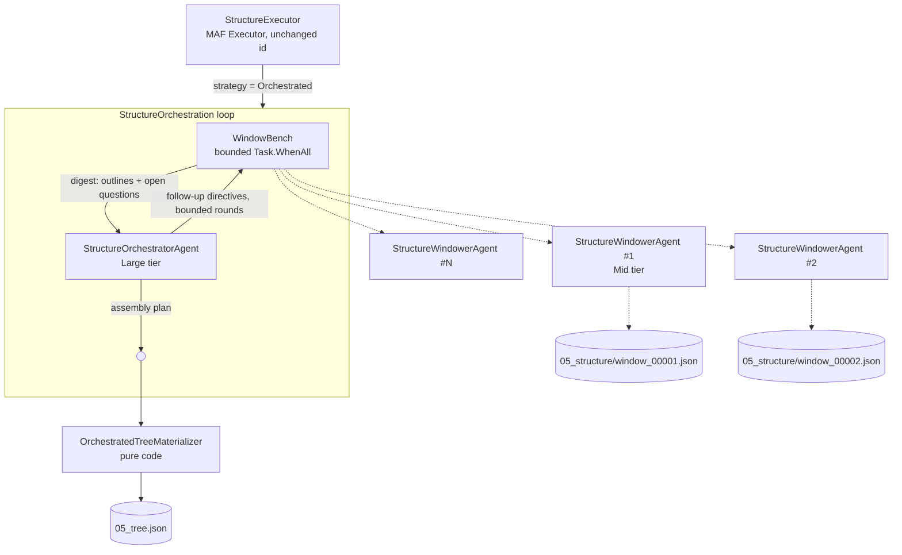

# Segmentation: an orchestrator for phase 5

Status: **built, unmeasured**. Track A steps 1–11 are implemented behind
`Pipeline:Structure:Strategy`, which defaults to `Chunked`; steps 11's gold documents and step 12's
experiment are outstanding, and Track B is gated on them. See §14 for exactly what landed.
Companion to `theplot-segmentation-plan.md`; section numbers below in the form §9.7 refer to that
document.

## 1. What is being proposed

Replace the current chunked structure inference with an orchestration in which a **large
orchestrator agent** drives a bench of **mid-tier window agents** that work on parts of the
document in parallel, asks them follow-up questions about what they returned, and itself produces
the final tree.

This started as "use MAF's group chat for it". §3 is why that does not work and what we build
instead: the pattern the question was after — parallel sub-agents, follow-ups, a smarter
assembler — survives intact; MAF's `AgentWorkflowBuilder` presets do not.

The hypothesis to test: *windowed work done by separate, cheaper sub-agents and assembled by one
smarter agent produces a better tree than windowed work assembled by code* — at a cost that is
justified on the documents where it applies.

The plan has two tracks. **Track A** (§2–§11) is that experiment. **Track B** (§12) is what the
orchestrator may author once it exists: adaptive retries, a record of what the sub-agents get
wrong, and a queue of proposals for new agents and new deterministic executors. Track B is
partly built during Track A — gap mining is cheap and the A/B run is the best dataset it will
ever get — but most of it is gated on the experiment succeeding.

## 2. What phase 5 does today

`StructureExecutor` (`Executors/StructureExecutors.cs`) has two paths:

1. **Deterministic.** Triage found nothing suspect and the headings form a coherent hierarchy →
   `DeterministicTreeBuilder.Build`. Zero model calls. Most clean Markdown uploads land here.
2. **Model.** `StructurerAgent.StructureAsync` renders a skeleton (ids + one excerpt per
   paragraph). If it fits `MaxSkeletonEntriesPerCall` (1 200), that is one large call and we are
   done. If it does not, `StructureInPartsAsync` runs:

```csharp
foreach (var part in parts)                       // sequential
{
    var partResult = await StructureOneAsync(part, paragraphs, context, ct);
    children.AddRange(partResult.Root.Children …); // splice
}
var root = Renumber(new SectionNode(…, children, …), …);
```

Two properties of that loop are the target of this proposal:

- **It is sequential.** Parts do not overlap in cost or in time; an eight-part document pays eight
  serial large-model calls.
- **The join is a splice.** Each part is unwrapped and concatenated. Nothing ever reasons across a
  part boundary. If part 2 ends with *"Schedules"* and part 3 opens with *"Appendix A"*, no agent
  and no line of code ever asks whether the second belongs under the first. Titles invented by
  part 5 are never reconciled with part 1's vocabulary. `Renumber` fixes ids; it cannot fix shape.

Everything else in the phase — the idempotency gate, the model pin, the artifact write, the
downstream `ValidateExecutor` and `StructureReviewExecutor` — is orthogonal and stays.

> **Note on "the current concurrent workflow".** The genuinely concurrent code in this pipeline is
> `LabelExecutor.LabelWindowsAsync` (batched `Task.WhenAll` over label windows). §13 argues that
> one should *not* move to an orchestrator. The sequential, splice-joined part of the pipeline —
> phase 5 — is where the orchestrator earns its keep.

## 3. The constraint MAF imposes

Checked against the pinned `Microsoft.Agents.AI.Workflows` **1.21.0**:

| API | Shape | Fits? |
|---|---|---|
| `GroupChatManager.SelectNextAgentAsync` | returns **one** `AIAgent` per iteration | turn-based only |
| `MagenticOrchestrator` / `MagenticProgressLedger.NextSpeaker` | one speaker per round, plus a manager planning call per round | turn-based only |
| `AgentWorkflowBuilder.BuildConcurrent` | fans the **same input** to every agent, aggregates | wrong shape — many opinions on one input, not one agent per window |

**A MAF group chat cannot run participants in parallel.** So the parallelism has to live *inside*
a participant. Two ways to do that:

- **(a) A fan-out participant.** A custom `AIAgent` whose `RunCoreAsync` issues N sub-agent calls
  with `Task.WhenAll` and returns one digest message. The chat sees one participant; the
  concurrency is its implementation detail.
- **(b) Sub-agents as tools.** The orchestrator is a tool-calling agent and the model emits
  parallel tool calls.

**(a) is the recommendation.** (b) requires extending `IRoutingChatClient.GetResponseAsync` to
accept tools — it takes `(messages, context)` today and builds `ChatOptions` internally with no
`Tools` — and, worse, it hands the *model* control over how many sub-agent calls happen. The
budget ledger, the sensitivity allow-list and the per-window idempotency keys all assume the
caller decides. (b) stays on the table as a later refinement; it is not the way to run the
experiment.

### 3.1 So what would `GroupChatWorkflowBuilder` still be buying us?

Once the fan-out has moved inside a participant, it is worth asking what is left. Feature by
feature:

| What the group chat provides | What we actually need | Verdict |
|---|---|---|
| `GroupChatManager.SelectNextAgentAsync` — LLM or custom turn selection | a fixed two-party protocol: bench → orchestrator → bench → final | a `switch` statement |
| Per-participant `AgentSession` history | our window agents are stateless by design (`AgentRunner`: "each round's context comes from artifacts, never chat history") | unused |
| `UpdateHistoryAsync` broadcast shaping | we build the orchestrator's message list ourselves anyway | unused |
| `OnCheckpointingAsync` hooks | v1 does not nest the chat in the outer checkpoint (§6) | unused in v1 |
| Agent run events for observability | we have `RunJournal` notes and OTel spans on the routing client | duplicated |

Nothing survives. And the cost is not zero: to smuggle a fan-out past a turn-based loop we would
subclass `AIAgent` — `RunCoreAsync`, `RunCoreStreamingAsync`, `CreateSessionCoreAsync`,
`SerializeSessionCoreAsync`, `DeserializeSessionCoreAsync` — for a class that calls no model and
holds no session. That is a wrapper written to satisfy a framework, not a design.

**Verdict: build the orchestration loop directly.** This is a change from where §10 originally
deferred the decision; the evidence above settles it now.

To be precise about what "our own" means, because it is a smaller thing than it sounds:

- **Kept, unchanged:** `WorkflowBuilder`, `Executor<TIn,TOut>`, `RequestPort`, the S3 checkpoint
  store, the superstep runner. `SegmentationWorkflowFactory` is already our own workflow — the
  main graph does not move, and `ExecutorIds.Structure` keeps its identity.
- **Not used:** `AgentWorkflowBuilder` and its presets (`CreateGroupChatBuilderWith`,
  `CreateMagenticBuilderWith`, `BuildConcurrent`).
- **Written by us:** a `StructureOrchestration` loop inside `StructureExecutor`, ~100 lines, with
  the protocol types and the materializer as separate, pure, testable pieces.

This is also what the codebase already does one phase earlier. `LabelExecutor` puts its fan-out
inside the executor rather than across MAF edges, for a reason that applies here verbatim: **MAF
graphs are static and the window count is not known until the document has been read.** Even the
fan-out arrows in §13.1 of the main plan are not real edges — they are loops inside an executor.
Nothing about the structure phase is more expressible as a graph than labelling was.

Keep the protocol records (§4.3) and the participants free of the loop, and moving onto
`GroupChatWorkflowBuilder` later stays a small change if a future MAF version grows parallel turns.

## 4. The design



### 4.1 Participants

**`StructureWindowerAgent`** (`ModelTier.Mid`, new role `AgentRole.StructureWindower`). Structures
one window of the skeleton. Same call-validate-repair loop as everything else (`AgentRunner`), same
`tree` schema, scoped to the window's paragraph ids. Additionally returns `openQuestions`: things
it could not settle without seeing outside its window ("the last section has no heading — it may
continue the previous window"). Stateless, one call per window, artifact per window.

**`WindowBench`** (a plain class, no model of its own). Takes a directive, fans out over the named
windows in bounded batches, and returns **one digest**: per window, its outline (titles + depth +
first/last paragraph id + node ids), plus its open questions. Never the full subtree — those stay
in S3 and are addressed by `(window, nodeId)`. Reuses the caching shape of
`LabelExecutor.LabelWindowsAsync`: a window whose artifact already carries this idempotency key is
free.

**`StructureOrchestratorAgent`** (`ModelTier.Large`, new role `AgentRole.StructureOrchestrator`).
The only stateful participant. Sees the digests, may ask follow-ups, and emits the final
**assembly plan**.

### 4.2 The loop

`StructureOrchestration.RunAsync` — the whole of it, in the shape it will actually take:

```csharp
var digest = await bench.StructureAllAsync(windows, ct);     // round 0: parallel, no orchestrator
var history = new List<ChatMessage> { Digest(digest) };

for (var round = 0; round < options.MaxOrchestratorRounds; round++)
{
    var reply = await orchestrator.AdvanceAsync(history, ct); // Large tier, via IRoutingChatClient
    history.Add(reply.Message);

    if (reply.Plan is { } plan)
    {
        return materializer.Apply(plan, subtrees);            // pure; throws with an exact report
    }

    var answers = await bench.AnswerAsync(reply.FollowUps, ct); // parallel again, Mid tier
    history.Add(Digest(answers));
}
```

Three things the framework would have managed, and where they live instead:

- **Turn order** is the loop. Bench first — the orchestrator has nothing to reason about until the
  windows have reported.
- **Termination** is `reply.Plan is not null`, plus the round cap. Not a `ShouldTerminateAsync`
  override reading a transcript to guess whether the conversation is over.
- **History shaping** is that `history` only ever receives digests and the orchestrator's own
  replies. Window agents never see the transcript at all, because they are called directly with
  the prompt they need. This is stricter than `UpdateHistoryAsync` trimming, and it is what keeps
  the sub-agents stateless per the invariant in `AgentRunner`'s docstring.

`history` is a `List<ChatMessage>` so the orchestrator call goes through `IRoutingChatClient`
unchanged — the same door every other agent uses, with the same budget ledger and sensitivity
filter in front of it.

### 4.3 The orchestrator composes references, not content

**This is the load-bearing decision.** The orchestrator never emits a paragraph id, and never emits
paragraph text. It emits an **assembly plan** over nodes the window agents already produced:

| op | meaning |
|---|---|
| `attach` | place window *w*'s node *n* under a parent path |
| `merge` | two windows split one section across a boundary — concatenate in document order |
| `retitle` | fix a title a window invented without cross-window context |
| `group` | introduce a new parent the source has no heading for (`inferred: true`) |
| `drop_wrapper` | unwrap a window's synthetic root (what `StructureInPartsAsync` does blindly today) |

`OrchestratedTreeMaterializer` (pure, in `Core/Tree/`) applies the plan to the window subtrees,
renumbers section ids in document order, and **asserts every paragraph id appears exactly once**.

The consequence is worth stating plainly: paragraph coverage becomes a property of the
materializer rather than a check that can fail. Today's `Checks.CheckIdCoverage` catches a
structurer that drops a paragraph *after the fact*, and pays a repair round for it. Here a plan
that would drop one cannot be materialized — the error is exact ("op 3 would orphan P00042…P00061")
and goes straight back to the orchestrator through the existing repair path. The
`text-integrity` invariant (§25.3: models never produce paragraph text) is strengthened, not
weakened, by adding an agent.

### 4.4 Windows

Extract `StructurerAgent.SplitSkeleton` into `Core/Windowing/StructureWindowPlanner.cs` — cut at
level-1 headings, cap at `MaxSkeletonEntriesPerCall`, fall back to fixed-size chunks for a
headingless document. Add what the current splitter lacks: **overlap context**, mirroring
`WindowPlanner.OverlapFraction`. Each window is shown the tail of the previous window's entries
as read-only context so a sub-agent can recognise a section that started before it.

Both strategies use this planner, so the extraction is a no-behaviour-change refactor that lands
first.

## 5. New and changed files

**Core**
- `Core/Windowing/StructureWindowPlanner.cs` — extracted, + overlap. New unit tests.
- `Core/Tree/AssemblyPlan.cs` — the plan's record types, and the digest/directive records the
  loop exchanges. Pure data, no dependency on the loop or on MAF.
- `Core/Tree/OrchestratedTreeMaterializer.cs` — plan + window subtrees → `SectionNode`. Pure; the
  heaviest test target in this change.
- `Core/Tree/WindowDirective.cs` — the retry parameterization of §12.3(b). Fragment ids only; no
  free text. Pure data.
- `Core/Learning/CapabilityGap.cs` — the gap record of §12.3(d).
- `Core/Options/PipelineOptions.cs` — new `StructureOptions`:
  `Strategy` (`Chunked` | `Orchestrated`, default `Chunked`), `FanOutBatchSize` (8),
  `MaxOrchestratorRounds` (4), `MaxFollowUpsPerRound` (6), `WindowOverlapEntries` (40),
  `MaxDirectivesPerRound` (4), `EmitCapabilityGaps` (true), `EnableAgentInstincts` (false).
- `Core/Model/Enums.cs` — `AgentRole.StructureWindower`, `AgentRole.StructureOrchestrator`.

**Pipeline**
- `Agents/StructureWindowerAgent.cs`
- `Agents/StructureOrchestratorAgent.cs`
- `Agents/WindowBench.cs` — plain class; bounded fan-out and artifact reuse
- `Agents/StructureOrchestration.cs` — the loop of §4.2
- `Executors/StructureExecutors.cs` — strategy branch only; the gate, pin, journal and artifact
  write are untouched. No new executor, no new `ExecutorIds` entry, no graph change in
  `SegmentationWorkflowFactory`.
- `Executors/RunArtifacts.cs` — `Read/WriteStructureWindowAsync`, `WriteAssemblyPlanAsync`,
  `WriteChatTranscriptAsync`.
- `Agents/CapabilityGapWriter.cs` — persists gaps; refuses any gap whose text is not drawn from
  the fixed observation vocabulary (§12.3(d)).
- Assets: `prompts/structure-window.v1.md`, `prompts/structure-orchestrator.v1.md`,
  `prompts/structure-followup.v1.md`, `skills/structure-orchestration/SKILL.md`,
  `schemas/assembly-plan.schema.json` + `schemas/wire/assembly-plan.schema.json`.
- Assets: `fragments/window/*.md` — the pre-authored retry fragments a `WindowDirective` may
  select. Embedded, so they already count toward `PromptVersion` and change no qualification row.

**Data**
- `Entities/CapabilityGap.cs` + migration — `Kind`, `Role`, `Observation`, `Proposal`, `RunId`,
  `Evidence`, `CreatedAt`. Read by people, never by a prompt.
- `Entities/AgentInstinct.cs` + migration — `(Role, Pattern)`, `Guidance`, `Confidence`,
  `Confirmations`, `LastSeen`, `PromotedAt`, `Provenance`. **Deliberately not** a column added to
  `FamilyInstinct`; see §12.2. Behind `EnableAgentInstincts`, default off.

**Storage**
- `ArtifactKeys`: `StructureWindow(runId, i)` → `runs/{runId}/05_structure/window_{i:D5}.json`;
  `AssemblyPlan(runId)` → `…/05_structure/plan.json`;
  `StructureChat(runId)` → `…/05_structure/chat.jsonl`;
  `CapabilityGaps(runId)` → `…/05_structure/gaps.json`.

## 6. Checkpointing and resume

Per-window artifacts carry `{runId}:structure-window:{i}:{promptVersion}`, so a resumed run
re-reads finished windows for free — the same mechanism that makes a mid-run deploy cheap for
labelling today.

The conversation itself is deliberately **not** checkpointed, and dropping the group chat is what
makes that a clean position rather than a gap. The loop is one superstep inside
`StructureExecutor`: if the worker dies mid-conversation, the run resumes at the top of the phase,
re-reads every finished window artifact for free, and replays the orchestrator rounds — a handful
of `Large` calls against outlines, not a re-run of the document. The transcript is still written to
`…/05_structure/chat.jsonl`, but as an audit record for the experiment, not as resume state.

That is a fair trade at `MaxOrchestratorRounds = 4`. If a later version raises that ceiling enough
to make replay expensive, the fix is to persist each round's digest under its own idempotency key —
the same pattern as the windows — not to reach for sub-workflow checkpointing.

One thing this still forces: **the orchestrator and the loop must be constructed inside
`HandleAsync`, not injected.** `StructureExecutor` is bound as a shared instance with
`declareCrossRunShareable: true`, and the whole reason that is safe is that it holds no run state.
A conversation is run state.

## 7. Routing, roles and spend

Two new roles means two new qualification keys — `IsQualifiedAsync(model, role, promptVersion)` —
so the model registry seed and `PresumedQualifiedRoles` need entries before anything routes.
Nothing else in the router changes: the orchestrator asks for `Large`, windowers ask for `Mid`,
the sensitivity filter runs first and unconditionally as it does now.

Both roles pin per run (`PinnedModels["StructureWindower"]`,
`PinnedModels["StructureOrchestrator"]`) so windows stay consistent with each other and a resumed
run does not switch models mid-document.

Spend is bounded by three independent things: the existing budget ledger, `FanOutBatchSize`, and
`MaxOrchestratorRounds`. The rough shape on an eight-window document, against today's eight serial
`Large` calls: eight parallel `Mid` calls plus two to four `Large` orchestrator calls whose input
is outlines, not skeletons. That may well be *cheaper* as well as faster — which is part of what
the experiment measures, not something to assume.

## 8. What must not regress

- **The deterministic path.** Clean headings + no suspect regions → zero model calls, no chat.
  This is the thing that makes a clean Markdown upload free, and the strategy flag is checked
  *after* that branch, not before.
- **The single-window path.** One window → one `StructureWindower` call and no orchestration.
  A bench of one has nothing to assemble.
- **text-integrity.** No participant emits paragraph text. The orchestrator additionally emits no
  paragraph ids (§4.3).
- **Sensitivity.** Every call goes through `IRoutingChatClient`. No participant constructs a
  provider client.
- **Executor identity.** `ExecutorIds.Structure` is unchanged — changing it strands in-flight runs.
- **Downstream.** `ValidateExecutor` and `StructureReviewExecutor` run unchanged over the result.
  The orchestrator is not a substitute for either.

And the four that Track B adds, each of which is an invariant rather than a preference (§12):

- **No prompt text is authored at runtime.** A `WindowDirective` selects among embedded fragments;
  it cannot carry free text. `PromptVersion` therefore never moves at runtime and no
  `Qualifications` row is invalidated.
- **`PresumedQualifiedRoles` stays a bootstrap.** Nothing in Track B may route through it. It is
  the escape hatch for a fresh deployment, not a path around the eval gate.
- **Gaps never reach a prompt.** `capability_gaps` rows are read by people and by reports. Nothing
  in the pipeline injects them.
- **Learned guidance never derives from document text**, and nothing promotes itself. `PromotedAt`
  is set by a person (§12.2) — the table has no `OwnerSubject`, so promotion crosses a tenant
  boundary that every other query enforces.

## 9. Feature flag and A/B

`StructureOptions.Strategy` defaults to `Chunked`. A per-run override lets the same document be
re-run both ways via the existing `RerunFrom`. The strategy is recorded on the tree artifact and
the run row so ThePlot can show which produced a given tree.

**The gold set is a prerequisite, not a detail.** `tests/gold-dev/` has four documents and the
existing harness (`DeterministicPipeline`, `GoldEvaluator`) makes no model calls at all — by
design. Neither strategy is even exercised by it. The experiment needs:

1. **At least four gold documents that exceed one window** (>1 200 skeleton entries) with
   adjudicated trees, across families — a legal filing with schedules and appendices and a long
   transcript are the cases where cross-boundary reasoning should matter most. Without these there
   is nothing to measure.
2. A `compare-structure` CLI command: run both strategies over the same documents against a real
   provider, score with `TreeEditDistance`/`GoldEvaluator`, emit a table.
3. Contract-test recordings for both strategies so CI stays deterministic and offline.

**Decide on:** tree edit distance to gold; section count delta; how many boundary sections were
correctly merged or reparented (the thing the splice cannot do); USD per document; wall clock;
model calls. Adopt only if the quality margin on multi-window documents justifies the cost —
and note that a *latency* win alone is also a legitimate reason to adopt, since these are the
slowest documents in the system.

**Two secondary outputs, not decision criteria.** Both come free from a run that is happening
anyway, and both inform Track B rather than the adopt/reject call:

- **Directive yield** — how often a windower had to be retried, at which tier, with which
  fragments, and whether the retry helped. If directives almost never fire, §12.3(b) is not worth
  building; if they fire constantly, the windower prompt is the thing to fix first.
- **Gap yield** — how many `capability_gaps` rows the experiment produces, and how they cluster by
  `kind`. A run of `kind: "deterministic"` clusters is the strongest possible argument for Track B,
  and the cheapest possible way to discover it.

## 10. Implementation order

Each step lands green on its own.

### Track A — the orchestration experiment

1. Extract `StructureWindowPlanner` into Core with overlap + tests. No behaviour change.
2. `StructureOptions` + the two new `AgentRole` values + registry seed entries.
3. Per-window artifact keys and `RunArtifacts` helpers.
4. `StructureWindowerAgent` + prompt asset + schema. Reachable from the chunked path too, which
   makes it testable before any orchestrator exists.
5. `AssemblyPlan` + `OrchestratedTreeMaterializer` + exhaustive unit tests (coverage, merge across
   boundary, inferred parents, duplicate detection, orphan detection).
6. `WindowBench` with a fake runner; assert bounded concurrency and artifact reuse.
7. `StructureOrchestratorAgent` + prompt + assembly-plan schemas (authoring and wire).
8. `StructureOrchestration` — the loop. Unit-testable end to end with a scripted fake
   orchestrator and bench, no provider and no workflow runner involved.
9. Wire into `StructureExecutor` behind the flag; transcript and plan artifacts; a journal note
   per round so ThePlot can watch the conversation progress.
10. **`capability_gaps` — the table, the entity, the writer, and the `gaps[]` field on the
    orchestrator's reply.** Pulled forward into Track A on purpose: it is perhaps a day's work, it
    cannot affect the tree (gaps are written, never read back), and it turns the A/B run into the
    dataset that decides whether the rest of Track B is worth building. Skipping it here means
    running the experiment twice.
11. New multi-window gold documents + `compare-structure` + recordings.
12. Run the experiment. If adopted: flip the default, fold §4 into
    `theplot-segmentation-plan.md` §9.7 and §13, and delete `StructureInPartsAsync`.

Steps 1–5 are useful regardless of the verdict: the planner, the per-window agent and the
materializer would improve the chunked path on their own. Step 8 is a plain loop rather than a
framework integration, which is the main schedule consequence of §3.1 — no `AIAgent` subclass to
write, no sub-workflow spike to run.

### Track B — what the orchestrator authors

Gated on step 12 adopting the orchestrator, and ordered by evidence rather than by ambition. Each
step should be justified by what the gap table actually contains, not by this document.

13. **Gap reporting.** Cluster `capability_gaps` by `kind` and proposal similarity; a report
    alongside the §26.3 evaluation reports. No new pipeline behaviour — this is the step that
    turns step 10's rows into decisions, and it is where most of Track B's value is realized.
14. **Retry directives** (§12.3(b)) — `WindowDirective`, the `fragments/window/*.md` assets, and
    the orchestrator's ability to choose among them. Build only if step 11's directive yield says
    retries are common enough to matter.
15. **Plans over existing roles** (§12.3(a)) — let the orchestrator arrange a re-run plus a
    `StructureReviewer` adjudication. Safe by construction; worth it once directives exist and the
    single-retry ladder is visibly insufficient.
16. **`agent_instincts`** (§12.3(c)) — the table, the provenance column, the `(pattern, runId)`
    dedupe, and the write path. Behind `EnableAgentInstincts`, off by default. Last because it is
    the only step with a persistence-across-runs blast radius, and because steps 13–15 may well
    have already fixed what it would have learned.

Not on the list, deliberately: anything that lets the orchestrator author prompt text or set
`PromotedAt`. §12.1 and §12.2 explain why those are not a later step but a different system.

## 11. Risks

- **The orchestrator is the single point of failure for the whole tree.** Today a bad part damages
  one part. Mitigated by the plan-not-content design (§4.3) and by falling back to the chunked
  splice when the materializer rejects the plan after its repair rounds — a splice is what we have
  now, so the fallback is never worse than the status quo.
- **Transcript growth.** Bounded by `UpdateHistoryAsync` trimming and `MaxOrchestratorRounds`.
  Worth a metric: orchestrator input tokens per round, so drift is visible rather than inferred
  from the bill.
- **Two new qualification keys.** Until a model is qualified for them, `NoEligibleModelException`.
  The registry seed has to land before the flag can be turned on anywhere.
- **We own the orchestration loop now, so its bugs are ours.** Retry, cancellation and round
  accounting are no longer a framework's problem. This is a real cost, and the mitigation is that
  the loop is ~100 lines with no I/O of its own: every call inside it already goes through
  `AgentRunner` and `IRoutingChatClient`, which is where retry, truncation handling and budget
  enforcement already live and are already tested.
- **Divergence from MAF's orchestration story.** If a future version grows parallel turns, we will
  have a loop where the framework has a preset. Kept cheap by holding the protocol records
  (`AssemblyPlan`, the digest and directive types) in `Core` with no dependency on the loop or on
  MAF — swapping the driver would not touch the agents, the schemas or the materializer.
- **Gap rows are model-authored text in a database.** They are read by people, which is exactly
  the audience prompt injection targets when it cannot reach a prompt. Treat the gap report as
  untrusted input in the UI that renders it, cap the field lengths, and keep `Evidence` to node and
  paragraph ids rather than quoted document text. Cheap to get right at step 10; awkward to
  retrofit once a report exists.
- **Track B optimizes for what the orchestrator finds hard, which is not the same as what is
  wrong.** A gap cluster says a model had to intervene; it does not say the intervention was
  correct. Every gap-derived change still goes through the §26 eval gate on its own merits — the
  table is a source of hypotheses, not of verdicts.
- **`EnableAgentInstincts` is a flag that will be tempting to turn on.** It is off by default and
  step 16 is last for a reason: it is the only part of this plan whose mistakes persist across runs
  and across tenants. The `(pattern, runId)` dedupe of §12.3(c) is not a refinement to add later —
  without it a single long document reaches the injection threshold on its own.

## 12. Self-improvement: what the orchestrator may author

The orchestrator sits where nothing else in the pipeline sits: it can see *which sub-agent failed
at what*, and it knows every fix it had to make by hand. Two things follow naturally — letting it
adapt when a windower misbehaves, and letting it record what should have existed so it would not
have had to intervene. Both are worth building. They have very different risk profiles, and the
difference is not obvious, so this section separates them. §10's Track B is the order to build
them in; this section is why that order is what it is.

The short version:

| Capability | Verdict |
|---|---|
| Compose a **new plan over existing roles** at runtime | **Yes** — every leaf is already qualified |
| Re-run a role with **different parameters and pre-authored fragments** | **Yes** — this is the escalation ladder, generalized |
| Write **observations about agent behaviour** into a learning table | **Yes, with provenance and per-run dedupe** |
| Emit **capability-gap proposals** (new agent, new deterministic executor) | **Yes — the most valuable part** |
| **Author prompt text at runtime** and call a model with it | **No** — see §12.1 |
| **Promote its own authored text to a skill** without a human | **No** — see §12.2 |

### 12.1 Why runtime-authored agents cannot route

Three independent blockers, each load-bearing.

**Qualification is keyed by prompt version.** `IModelRegistry.IsQualifiedAsync(model, role,
promptVersion)` reads a `Qualifications` row; §26.5 defines that row as the result of running the
role's task over the holdout set at k = 3 and clearing its thresholds, and requires re-qualification
**on prompt change**. Prompt text authored at runtime produces a `promptVersion` no row exists for,
so the very next call throws `NoEligibleModelException`. The bypass would be
`PresumedQualifiedRoles` — which `ModelRegistry.Impl` documents as "the bootstrap escape hatch…on a
fresh deployment nothing has been evaluated yet". Using it to wave through self-authored prompts
converts a deliberate, temporary bootstrap into a permanent hole in the evaluation gate.

**An agent needs a role, and `AgentRole` is a compiled enum.** The router filters on it, the
qualification rows key on it, the sensitivity allow-list is evaluated per call in its terms. An
agent invented at runtime has no role and therefore no eligible model. This is not incidental
coupling — the enum is *why* "which models may do this job" is a question with an answer.

**Rollback stops being coherent.** `PromptAssets` embeds assets as resources specifically so
`PromptVersion` is a property of the deployed image (§23.5): rolling the image back rolls the
prompts back with it, and the qualification records for that version are still in the database.
Prompts that live outside the image break that in both directions — a rollback no longer restores
the prompts, and the restored image's qualification records no longer describe what will run.

### 12.2 Why "save it as a skill" needs the human that is already in the design

The loop being asked for **already exists**, and `FamilyInstincts` is it:

```
reviewer/human correction
  → ConfirmAsync (starts at 0.3, +20% of the remaining gap per confirmation, −0.05/30d decay)
  → injected into labeler and structurer prompts at ≥ 0.7, max 6
  → [human reviews high-confidence clusters]
  → promoted into a family skill  ← FamilyInstinct.PromotedAt is this seam
```

So the question is not whether the pipe exists. It is whether the orchestrator may write into it,
and whether `PromotedAt` can be set without a person. Writing: yes, with conditions. Promotion:
no, and the reason is a threat the main plan already names.

**§24.1, row 2:** *"Injected text persisting via instincts — Instincts derive only from
reviewer/human corrections, **never from document text**; advisory only."*

An orchestrator that authors guidance from what it observed while reading a document is precisely
the mechanism that row exists to prevent. A document crafted to make windowers respond in a shaped
way would be teaching the pipeline, and the lesson would outlive the run.

**And it would cross a tenant boundary.** `FamilyInstinct` has `Family`, `Pattern`, `Guidance`,
`Confidence`, `Confirmations`, `LastSeen`, `PromotedAt` — and **no `OwnerSubject`**. Instincts are
global to a document family. Everything else in the system filters on `owner_subject` from the
internal JWT (§24.1, row 5); the instinct table is the one place that does not, because a human
stands between a correction and a promotion. Remove the human and one customer's document can
shape how another customer's documents are read. That is the sharpest reason this step stays
manual, and it is not a policy preference — it is the isolation property every other query enforces.

### 12.3 What to build instead

**(a) Plans over existing roles.** The orchestrator may compose a *workflow* it was not given:
"re-run windower on window 4 with the bounds shifted to start before the heading, then have
`StructureReviewer` adjudicate the two results." This is genuinely the orchestrator defining new
behaviour, and it is safe for a boring reason: every leaf is an already-qualified `(model, role,
promptVersion)`. Nothing new is authored; something new is *arranged*.

**(b) Directives, not prompts.** When a windower responds badly, the orchestrator emits a
`WindowDirective` for the retry rather than new instructions:

```csharp
public sealed record WindowDirective(
    int WindowIndex,
    ModelTier Tier,                       // escalate — LabelerAgent.EscalateAsync already does this
    IReadOnlyList<string> FragmentIds,    // pre-authored, embedded, part of PromptVersion
    WindowBounds? Rebound,                // re-cut the window; the planner is deterministic
    IReadOnlyList<string> Focus);         // paragraph ids to attend to
```

`FragmentIds` is the whole trick: the *fragments* are embedded assets that already count toward
`PromptVersion`, so selecting among them changes behaviour without changing the version or
invalidating a single qualification row. This is `LabelerAgent`'s existing ladder — escalate a
tier, re-ask with targeted context — generalized and put under the orchestrator's control.

Record the chosen directive in the window artifact. Reproducibility today rests on
`(promptVersion, pinned model, inputs)`; adding fragment selection preserves it only if the
selection is written down.

**(c) An agent-behaviour learning table, separate from the family one.** The orchestrator may
record observations — but about **the pipeline's own behaviour**, never about document content:

> *"`StructureWindower` at Mid tier returns a flat tree when the window's skeleton contains no
> level-1 heading."*

That is a statement about an agent. It is checkable, and it is the line that keeps §24.1 intact: an
instinct whose text quotes or paraphrases document content is rejected at write time.

Use a **new table** (`agent_instincts`, keyed on `(Role, Pattern)`), not `FamilyInstincts`. Sharing
the table would put model-authored rows beside human-authored ones with no way to tell them apart,
and the `PromotedAt` review would silently inherit the ambiguity. At minimum a provenance column;
better, a separate table, because the scoping key genuinely differs — role, not family.

**Dedupe confirmations by `(pattern, runId)`.** Without this the feature is exploitable by
accident: a 40-window document would "confirm" the same pattern 40 times in one run and cross the
0.7 injection threshold immediately, defeating the diminishing-returns curve that is supposed to
require five or six *independent* sightings. Confidence should require distinct runs, and
distinct documents.

**(d) Capability-gap mining — the most valuable half.** Every fix the orchestrator applies itself
is evidence of a missing capability. The `retitle` and `group` ops of §4.3 *are* generation: when
the orchestrator invents a title for a section spanning windows 3 and 4, something upstream should
have produced it. Have it emit, beside the assembly plan:

```json
{ "gaps": [ {
    "kind": "deterministic",
    "evidence": ["W3:n7", "W4:n1"],
    "observation": "invented a title for a section neither window titled; both fragments begin
                    with the same numbered prefix '4.2'",
    "proposal": "a numbering-prefix title rule in SkeletonBuilder would have produced this"
} ] }
```

Gaps go to a `capability_gaps` table and an artifact. **They never go into a prompt** — that is
what keeps this outside §24.1's blast radius entirely: a gap is read by people, not by models.

`kind: "deterministic"` clusters are the ones to want. The pipeline already holds this taste:
`ValidateExecutor` refuses to repair a `text-integrity` failure with a model because "models never
produce paragraph text, so this is a defect in the assembly or cleaning code" — it pages instead.
Gap mining is that principle turned into a feedback loop. Every time a model does something code
could have done, a latent deterministic function has announced itself.

The loop then closes through git: cluster the gaps, a person turns a cluster into a PR — a new
`AgentRole` with its prompt asset, or a new deterministic executor — CI's eval gate qualifies it,
the image ships, and `PromptVersion` moves coherently with it. That is slower than
self-modification and it is the only path that ends with a *qualified* model and a working
rollback.

### 12.4 If runtime-authored prompts are genuinely wanted

There is a coherent version; it is just a large build, so it should be chosen deliberately rather
than arrived at. Make the runtime overlay content-hashed **into** `PromptVersion`, then require the
§26.5 qualification run to pass before the router will use it: author → shadow-evaluate against the
holdout set at k = 3 → write a `Qualifications` row → only then eligible. Nothing in §12.1 is
violated, because the new version is qualified like any other.

The costs are real and worth naming. Holdout gold documents are needed per role, and §9 already
notes the set does not yet cover multi-window structure at all. Every authored variant costs a full
qualification run. Rollback needs the overlay versioned alongside the image, or §23.5's guarantee
has to be restated. And a tenant-scoping decision has to be made for the overlay that
`FamilyInstinct` never had to make.

**Recommendation: do (a)–(d) first regardless.** They deliver most of the value — adaptive retries,
a record of what the agents get wrong, and a queue of concrete proposals for new agents and new
deterministic executors — without touching the qualification, rollback or isolation properties.
Whether §12.4 is ever worth it will be much clearer after the gap table has a few hundred rows in
it, because those rows are exactly the evidence for what a self-authored agent would need to do.

## 13. Deliberately out of scope

**Labelling stays as it is.** It is already concurrent, and its merge is not a splice — it rests on
an invariant the planner guarantees: *every line in a suspect region is committed by exactly one
window*. `LabelMerger` needs no judgement because there is never a tie. Handing that to an
orchestrator would replace a guarantee with an opinion, spend a large-model call per document to
do it, and make the result non-reproducible. If the phase-5 experiment succeeds, the narrow
follow-up worth considering is asking an orchestrator about **overlap regions where two windows
disagree** — the small set of genuine ambiguities — not the whole merge.

**Magentic.** `MagenticWorkflowBuilder` brings a planning call and a progress-ledger call per
round, plan sign-off aimed at human-in-the-loop, and adaptive replanning. Our protocol is fixed
and known in advance; all of that is cost without a decision to make — and per §3.1 it would not
even give us the parallelism, since Magentic picks one speaker per round too.

**Tool-calling orchestration.** §3(b). Revisit once the routing client has a reason to carry tools.

**Self-authored agents that route.** §12 covers what the orchestrator may and may not author. The
short form: it may arrange existing qualified roles freely and propose new ones for people to
build, but it may not author prompt text and then call a model with it.


## 14. What landed, and what did not

### Built

| Step | Where |
|---|---|
| 1. `StructureWindowPlanner` + overlap | `Core/Windowing/StructureWindowPlanner.cs`, `StructureWindowPlannerTests` |
| 2. `StructureOptions`, the two roles, the registry seed | `Core/Options/PipelineOptions.cs`, `Core/Model/Enums.cs`, `Worker/appsettings.json` |
| 3. Per-window keys and artifact helpers | `Storage/ArtifactKeys.cs`, `Executors/IdempotencyKeys.cs`, `Executors/RunArtifacts.cs` |
| 4. `StructureWindowerAgent` + assets | `Agents/StructureWindowerAgent.cs`, `prompts/structure-window.v1.md`, `schemas/structure-window.schema.json` |
| 5. `AssemblyPlan` + `OrchestratedTreeMaterializer` | `Core/Tree/`, 15 unit tests in `OrchestratedTreeTests` |
| 6. `WindowBench` | `Agents/WindowBench.cs` |
| 7. `StructureOrchestratorAgent` + assets | `Agents/StructureOrchestratorAgent.cs`, `prompts/structure-orchestrator.v1.md`, `schemas/assembly-plan.schema.json` |
| 8. `StructureOrchestration` | `Agents/StructureOrchestration.cs`, 7 tests in `StructureOrchestrationTests` against a scripted router |
| 9. Wired behind the flag | `Executors/StructureExecutors.cs` — strategy branch, transcript/plan artifacts, a journal note per round |
| 10. `capability_gaps` | `Data/Entities/CapabilityGap.cs`, migration `20260918201841_CapabilityGaps`, `Agents/CapabilityGapWriter.cs` |
| 11. `compare-structure` | `Cli/CompareStructureCommand.cs` |

Three decisions the implementation settled that this document left open:

- **The plan is a flat, depth-numbered outline rather than an op list** (§4.3). All five operations
  fall out of it with no `op` field: `attach` is a row's depth, `group` is a row with a title and no
  sources, `retitle` is a row with both, `merge` is a row with several sources, and `drop_wrapper`
  is never naming a window's root. An op list would have had to make each operation separately
  valid, and a plan that is half applied is worse than one that is rejected.
- **Follow-ups are a closed vocabulary of four questions**, not free text. §4.2 wanted the
  orchestrator to ask; §12.1 forbids it authoring prompt text. A `kind` plus a node reference
  satisfies both, and makes "which question was asked" an auditable field. The sentences live in
  `StructureWindowerAgent.RenderQuestions`, in the image.
- **Retitling a heading-anchored section is rejected**, not applied. `heading-anchor` forbids a node
  that claims an inferred title while pointing at a source line; those two statements contradict
  each other, so the materializer returns an exact error rather than silently dropping one of them.

The conversation overload on `AgentRunner` appends turns; the single-prompt overload still
replaces, so no existing agent's repair behaviour moved.

### Not built

- **Multi-window gold documents.** Four adjudicated trees over documents that exceed one window.
  This is the prerequisite §9 calls a prerequisite, and it needs the documents and a person to
  adjudicate them — it cannot be synthesised.
- **Contract-test recordings for both strategies.** The loop is covered offline and
  deterministically by `StructureOrchestrationTests` against a scripted router, which is what
  recordings would have bought CI. Recordings against a real provider still want provider access.
- **Step 12, the experiment**, and therefore all of Track B.

`compare-structure` scores trees rather than producing them: `segctl` reaches no provider, no
database and no Redis, and keeping that true is worth more than having one command that runs a
whole pipeline. The worker produces the two trees — the same document, run twice with
`Seg_Pipeline__Structure__Strategy` set each way — and the CLI scores them. Cost and wall clock are
in `model_calls`, keyed by run id.
